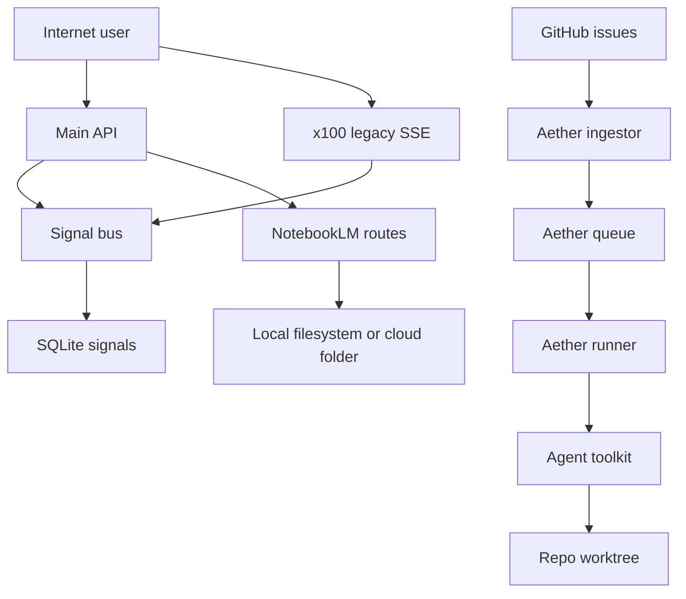

Assumption-validation check-in:

- Asumo que `x100_cortex_server.py` puede desplegarse como servicio runtime separado y no solo como demo local.
- Asumo que la separación por `tenant_id` es un control de seguridad real para eventos y memoria, no solo una convención lógica.
- Asumo que `Aether` solo se activa cuando `aether_enabled` está a `true`, pero que al activarse puede operar sobre repos locales reales.
- Asumo que `NotebookLM` route code es relevante para revisión manual aunque su montaje en la app principal no está confirmado en el código leído.
- El usuario no respondió a las preguntas de contexto sobre exposición, multi-tenancy y enablement de `Aether`/`NotebookLM`, así que las prioridades condicionadas se marcan como tales.

Targeted context questions left unresolved:

1. ¿`x100_cortex_server.py` corre hoy fuera de localhost o de una red interna?
2. ¿`Aether` está habilitado contra repos con issues públicas o solo en entornos internos?
3. ¿Las rutas `NotebookLM` están montadas en producción en otra app o están actualmente sin exponer?

## Executive summary

El tema de riesgo principal no es el API FastAPI autenticado, sino la coexistencia de superficies paralelas con garantías distintas. La prioridad más alta es un servicio SSE legacy sin autenticación ni tenant scoping explícito si llega a exponerse, seguido por la cadena `GitHub issue -> Aether task -> tool dispatch` que hoy permite que input externo termine influyendo en acciones de mutación local y shell cuando `Aether` está habilitado. La superficie `NotebookLM` muestra un bypass de confinamiento por prefijo de path, pero su prioridad queda condicionada a que esas rutas estén realmente montadas.

## Scope and assumptions

- In-scope paths:
  - `x100_cortex_server.py`
  - `cortex/routes/events.py`
  - `cortex/api/events.py`
  - `cortex/auth/stream.py`
  - `cortex/extensions/signals/bus.py`
  - `cortex/extensions/aether/daemon.py`
  - `cortex/extensions/aether/github_ingestor.py`
  - `cortex/extensions/aether/runner.py`
  - `cortex/extensions/aether/executor.py`
  - `cortex/extensions/aether/tools.py`
  - `cortex/extensions/daemon/initializer.py`
  - `cortex/routes/notebooklm.py`
  - `cortex/routes/__init__.py`
- Out-of-scope:
  - `tests/**`, frontend Astro pages, build scripts, SDK packaging, CI/release tooling.
  - Generic LLM quality or hallucination risk unless it creates a concrete security path.
- Explicit assumptions:
  - `x100_cortex_server.py` is a deployable runtime artifact.
  - `tenant_id` is a security boundary for signals and telemetry.
  - `Aether` can be pointed at repos with meaningful credentials/remotes.
  - `NotebookLM` route risk is conditional because router mounting was not confirmed in `cortex/routes/__init__.py`.
- Open questions that would materially change ranking:
  - Whether `x100_cortex_server.py` is ever internet-exposed.
  - Whether external users can cause issues to receive the `aether` label.
  - Whether `NotebookLM` routes are mounted in another runtime entrypoint.

## System model

### Primary components

- Main FastAPI API with authenticated SSE surfaces and unified router inclusion.
  - Evidence anchors: `cortex/routes/__init__.py:40-69`, `cortex/routes/events.py:86-94`, `cortex/api/events.py:60-68`.
- Standalone legacy SSE service with permissive CORS and no auth check.
  - Evidence anchors: `x100_cortex_server.py:39-46`, `x100_cortex_server.py:115-150`.
- Signal bus and tenant-scoped event store abstraction.
  - Evidence anchors: `cortex/extensions/signals/bus.py:24-36`, `cortex/extensions/signals/bus.py:43-67`, `cortex/extensions/signals/bus.py:183-214`.
- Optional autonomous `Aether` daemon gated by config.
  - Evidence anchors: `cortex/extensions/daemon/initializer.py:235-254`.
- `Aether` GitHub ingestion and LLM-driven execution loop.
  - Evidence anchors: `cortex/extensions/aether/github_ingestor.py:67-118`, `cortex/extensions/aether/runner.py:37-66`, `cortex/extensions/aether/executor.py:19-48`, `cortex/extensions/aether/tools.py:368-418`.
- NotebookLM export/sync route implementation with write-capable path parameters.
  - Evidence anchors: `cortex/routes/notebooklm.py:103-210`.

### Data flows and trust boundaries

- Internet/User -> Main FastAPI SSE routes
  - Data: API key, event stream payloads, tenant-scoped telemetry.
  - Channel: HTTP/SSE.
  - Security guarantees: `require_stream_permission("read")` authenticates and sets tenant context on the main API routes.
  - Validation: auth manager validation; event type filter only.
  - Evidence anchors: `cortex/auth/stream.py:18-58`, `cortex/routes/events.py:40-80`, `cortex/api/events.py:13-58`.

- Internet/User -> Standalone `x100` SSE service
  - Data: event payloads, synthetic snapshot state, legacy logs, agent state vector.
  - Channel: HTTP/SSE with wildcard CORS.
  - Security guarantees: none visible in the route.
  - Validation: none visible beyond request disconnect handling.
  - Evidence anchors: `x100_cortex_server.py:39-46`, `x100_cortex_server.py:115-140`.

- GitHub Issues -> Aether task queue
  - Data: issue title/body, repo identifier, issue number.
  - Channel: GitHub REST API via PAT.
  - Security guarantees: token-authenticated fetch to GitHub; no provenance tagging or sanitization of issue body before task creation.
  - Validation: dedupe by issue key and label state, not content safety.
  - Evidence anchors: `cortex/extensions/aether/github_ingestor.py:67-118`.

- Aether task description -> Planner/Executor -> AgentToolkit
  - Data: task description, repo contents, shell commands, git operations, web lookups.
  - Channel: in-process LLM orchestration and local subprocess execution.
  - Security guarantees: repo path confinement, shell classifier/taint guard, optional capability guard.
  - Validation: no capability guard is provided in daemon path; `allowed_tools=None` leaves the legacy dispatcher open to all handlers.
  - Evidence anchors: `cortex/extensions/aether/runner.py:37-66`, `cortex/extensions/aether/runner.py:98-115`, `cortex/extensions/aether/tools.py:96-132`, `cortex/extensions/aether/tools.py:368-418`.

- Authenticated client -> NotebookLM export/sync routes
  - Data: output path, output dir, drive path, exported digest/domain files.
  - Channel: HTTP query params and local filesystem/cloud-sync copy.
  - Security guarantees: `require_permission("write")`.
  - Validation: path checks use string prefix matching on resolved paths.
  - Evidence anchors: `cortex/routes/notebooklm.py:103-210`.

#### Diagram

## Assets and security objectives

- Tenant-scoped signals and telemetry.
  - Why it matters: confidentiality and tenant isolation; leakage undermines the product’s trust model.
- Local repo worktrees and git remotes touched by `Aether`.
  - Why it matters: integrity of source code and possibility of unintended push/commit.
- API keys, GitHub PAT, and daemon configuration.
  - Why it matters: enables authenticated access to streams or privileged GitHub ingestion.
- Filesystem locations under the repo root and user home used by NotebookLM exports.
  - Why it matters: integrity of exported artifacts and risk of writing/copying outside intended boundaries.
- Legacy dashboard snapshot state in `x100`.
  - Why it matters: may expose operational metadata, logs, and synthetic agent state without auth.

## Attacker model

- Capabilities:
  - Remote unauthenticated user if the standalone `x100` service is exposed.
  - Authenticated low-privilege API key holder with `write` permission if NotebookLM routes are mounted.
  - External issue author or malicious collaborator if `Aether` is enabled on public repos and issue labeling is attacker-influenced.
- Non-capabilities:
  - No assumption of OS root, DB shell access, or arbitrary code execution before hitting these surfaces.
  - No assumption that the main FastAPI event routes are unauthenticated; current code shows auth on those surfaces.
  - No assumption that dead code is deployed; conditional rankings are marked where route mounting is unconfirmed.

## Threats

### T1. Unauthenticated telemetry disclosure from the standalone legacy SSE service

- Abuse path:
  - A remote client connects to `GET /v1/events/stream` on the `x100` service.
  - The handler creates `AsyncSignalBus(app.state.db_conn)` and calls `bus.poll(consumer=..., limit=20)` without passing `tenant_id`.
  - The default tenant `"default"` is used by the bus, and the route also emits a legacy snapshot containing logs and `agent_states`.
- Impacted assets:
  - Tenant-scoped signals, operational logs, synthetic state.
- Existing mitigations:
  - None visible on this service; the main API has separate authenticated stream routes.
- Likelihood: High if deployed anywhere reachable beyond localhost. The route is directly exposed, lacks auth, and CORS is wildcard.
- Impact: High. It can disclose event payloads and operational state for the default tenant and weakens any tenant-isolation narrative.
- Overall priority: Critical if internet-exposed; Medium if strictly localhost/internal.
- Evidence anchors:
  - `x100_cortex_server.py:39-46`
  - `x100_cortex_server.py:115-140`
  - `cortex/extensions/signals/bus.py:183-214`
- Recommended mitigations:
  - Remove or firewall the standalone SSE service from untrusted networks.
  - Require the same stream auth layer used by the main API.
  - Pass explicit `tenant_id` and do not emit aggregate legacy snapshot data to unauthenticated clients.
  - Add deployment guardrails so this service cannot bind `0.0.0.0` outside approved environments.
- Detection ideas:
  - Alert on requests to `x100` SSE endpoints from non-loopback sources.
  - Log and rate-limit distinct SSE consumer counts and origin IPs.

### T2. GitHub issue content can drive autonomous local mutation through `Aether`

- Abuse path:
  - `AetherDaemon` is enabled and polls GitHub repos using a PAT.
  - `GitHubIngestor` fetches `aether`-labeled issues and concatenates raw title/body into `AgentTask.description`.
  - `AetherDaemon._run_task_thread()` instantiates `AetherAgent` without `agent_id`.
  - `AetherAgent` builds `AgentToolkit(..., allowed_tools=self._allowed_tools)` where `_allowed_tools` stays `None`.
  - `ExecutorAgent` exposes `bash`, git, file-write, and web tools; `AgentToolkit.dispatch()` only blocks by allowlist when `allowed_tools is not None`, so all handlers remain callable in this daemon path.
- Impacted assets:
  - Local repo integrity, git remotes, filesystem within repo path, external network egress via `web_search`.
- Existing mitigations:
  - Feature flag style enablement via `aether_enabled`.
  - Repo path confinement and shell classifier/taint guard.
  - No positive capability restriction in the daemon default path.
- Likelihood: Medium. This depends on `Aether` being enabled and on attacker influence over labeled issues, but the chain is direct once those preconditions hold.
- Impact: High. The agent can mutate code, run shell commands, create commits/branches, and potentially push changes.
- Overall priority: High.
- Evidence anchors:
  - `cortex/extensions/daemon/initializer.py:239-252`
  - `cortex/extensions/aether/daemon.py:54-61`
  - `cortex/extensions/aether/daemon.py:99-102`
  - `cortex/extensions/aether/github_ingestor.py:67-118`
  - `cortex/extensions/aether/runner.py:37-66`
  - `cortex/extensions/aether/runner.py:98-115`
  - `cortex/extensions/aether/executor.py:19-48`
  - `cortex/extensions/aether/tools.py:96-132`
  - `cortex/extensions/aether/tools.py:368-418`
- Recommended mitigations:
  - Require a non-null `agent_id` plus `CapabilityGuard` in the daemon path.
  - Treat GitHub issue text as untrusted input with provenance tags and injection filtering before planner/executor use.
  - Restrict issue ingestion to trusted authors/repos or require explicit human approval before `bash`, `git_commit`, and `git_push`.
  - Disable remote network tools for externally sourced tasks by default.
- Detection ideas:
  - Audit every `Aether` task with origin metadata, issue author, repo, chosen tools, and any shell commands executed.
  - Alert on `git_push`, network calls, or branch creation triggered from GitHub-sourced tasks.

### T3. Conditional path-confinement bypass in NotebookLM export/sync routes

- Abuse path:
  - An authenticated caller with `write` permission supplies `output`, `output_dir`, or `drive_path`.
  - The route resolves the path but validates it using `str(resolved).startswith(str(base_dir_or_home))`.
  - Prefix-based checks can be bypassed by sibling paths that share the same string prefix (for example, `<repo>-evil` next to the repo, or home-like sibling paths).
  - The route then writes or copies files to the attacker-chosen resolved location.
- Impacted assets:
  - Filesystem integrity under the repo neighborhood or home-directory neighborhood.
- Existing mitigations:
  - `require_permission("write")`.
  - Atomic local writes for digest output.
  - No robust ancestor check and no dedicated export root confinement.
- Likelihood: Medium if the routes are mounted and reachable by a write-capable principal. Lower if this code is currently dead.
- Impact: Medium to High depending on what files or sync destinations sit under the bypassed prefix path.
- Overall priority: High if mounted; Low if not deployed.
- Evidence anchors:
  - `cortex/routes/notebooklm.py:103-122`
  - `cortex/routes/notebooklm.py:133-150`
  - `cortex/routes/notebooklm.py:171-180`
  - `cortex/routes/__init__.py:42-69`
- Recommended mitigations:
  - Replace prefix checks with `Path.is_relative_to()` or explicit ancestor membership checks on fully resolved paths.
  - Restrict outputs to dedicated subdirectories rather than arbitrary user-supplied paths.
  - Reject absolute paths and symlink escapes explicitly.
  - Confirm mount status and remove dead route code if this surface is not meant to ship.
- Detection ideas:
  - Log resolved output paths and alert when they fall outside approved export roots.
  - Add tests for sibling-prefix bypasses and symlink cases.

## Mitigations and recommendations

- Highest-value immediate actions:
  - Disable or authenticate `x100` SSE before any external exposure.
  - Force `CapabilityGuard` and explicit tool allowlists in `AetherDaemon`’s construction path.
  - Sanitize/provenance-tag GitHub issue content before it becomes planner/executor input.
  - Replace all string-prefix path checks in NotebookLM routes with ancestor checks.
- Existing mitigations worth preserving:
  - Main SSE API routes already use `require_stream_permission("read")`.
  - `Aether` has repo path confinement and shell guards, even though positive authorization is still missing.
  - NotebookLM routes already require `write` permission.
- Residual risk after those fixes:
  - Query-param API keys on SSE remain a leakage risk in logs/referrers and should be revisited separately.
  - Duplicate event surfaces increase drift risk even when each surface is individually fixed.

## Focus paths for manual security review

- `x100_cortex_server.py` — standalone runtime surface with unauthenticated SSE and wildcard CORS.
- `cortex/extensions/signals/bus.py` — tenant defaults and event delivery semantics define the confidentiality boundary.
- `cortex/routes/events.py` — authenticated SSE route used by the unified router and worth regression-checking for tenant handling.
- `cortex/api/events.py` — duplicate SSE implementation increases auth drift risk.
- `cortex/auth/stream.py` — browser-compatible auth fallback introduces query-param credential exposure tradeoffs.
- `cortex/extensions/daemon/initializer.py` — feature-flag enablement path for `Aether`.
- `cortex/extensions/aether/daemon.py` — daemon construction path drops explicit agent/tool restrictions.
- `cortex/extensions/aether/github_ingestor.py` — untrusted issue body becomes task text.
- `cortex/extensions/aether/runner.py` — planner/executor receive raw task text and instantiate toolkit permissions.
- `cortex/extensions/aether/executor.py` — exposes the available tool surface to the LLM loop.
- `cortex/extensions/aether/tools.py` — final authorization and execution choke point for shell/git/file/network actions.
- `cortex/routes/notebooklm.py` — write-capable path parameters with weak confinement checks.

## Quality check

- All discovered runtime entrypoints covered:
  - Yes; main SSE routes, standalone SSE service, Aether ingestion/execution, and NotebookLM export routes were modeled.
- Each trust boundary represented in threats:
  - Yes; internet-to-SSE, GitHub-to-Aether, and authenticated-write-to-filesystem are each covered.
- Runtime vs CI/dev separation:
  - Yes; build scripts, tests, and SDK packaging were excluded from the threat ranking.
- User clarifications reflected:
  - No clarifications were provided; assumptions remain explicit and conditional rankings were used where needed.
- Assumptions and open questions explicit:
  - Yes.
