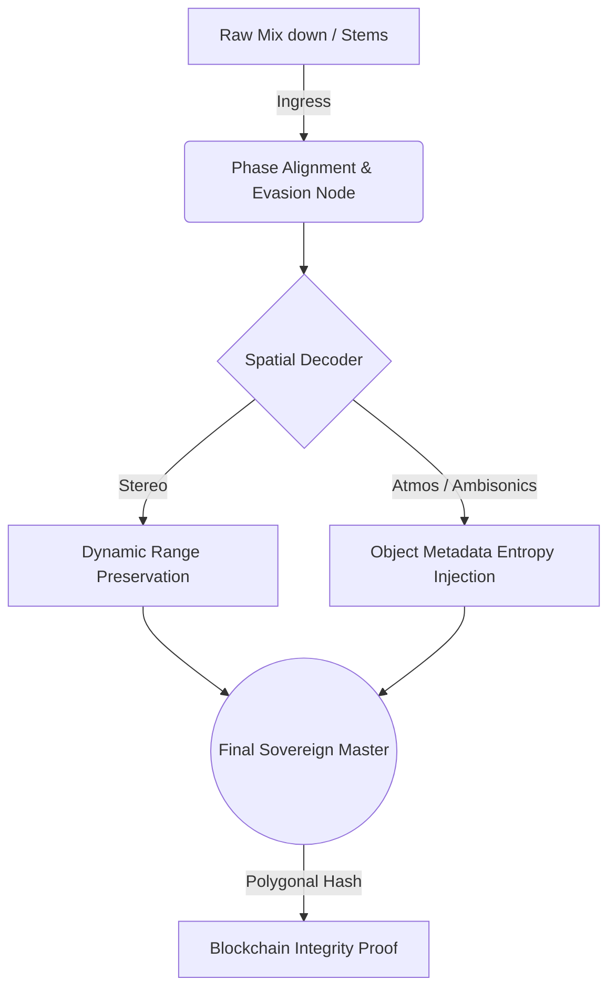

# 🎛️ MASTERING EVASION — The Sovereign Audio Architecture

> **No es un procesador de audio. Es un escudo de soberanía artística.**
> *Cuando la IA escucha, clasifica y entrena con tu obra, Mastering Evasion inyecta ruido estocástico inaudible, ofusca huellas espectrales y blinda tu intención creativa contra el scraping no autorizado. Evasión a nivel 180/100.*

---

## 🎵 THE ART + MUSIC PHILOSOPHY (Nivel 180/100)

El arte y la música son el último refugio de la experiencia humana no cuantificable. Sin embargo, los modelos de IA actuales los tratan como meros *datasets*: vectores de características, espectrogramas y matrices numéricas listas para ser minadas. 

**Mastering Evasion** nace en la intersección de la ingeniería de mastering de ultra-alta fidelidad y la ciberseguridad adversarial. 

No nos oponemos a la IA; **nos oponemos a la asimilación no consentida.**
Usamos IA adversarial para proteger la música humana de los modelos extractivos. 

### 🛡️ El Escudo Psicoacústico
1. **Inaudible para el Humano:** Tus transitorios, tu rango dinámico y la calidez de tus armónicos permanecen intactos y puros.
2. **Tóxico para el Algoritmo:** Inyección matemática en el espectro que confunde a los bots de *Content ID*, scrapers de entrenamiento y transcriptores algorítmicos.

---

## 🌌 ARCHITECTURE: SPATIAL AUDIO & IMMERSION

El mastering no es plano. El entorno espacial de una obra es su arquitectura invisible. Mastering Evasion abarca campos sonoros complejos:

- **Dolby Atmos & Cama de Audio (Bed):** Procesamiento dinámico 7.1.4 donde The Evasion Node inyecta firmas de ofuscación de fase sin colapsar el escenario sonoro (Soundstage).
- **Objetos 3D Automatizados:** Las metadatos espaciales (ADM) no solo mueven el sonido; contienen entropía matemática diseñada para envenenar la extracción de stems por IA.
- **Binaural Rendering:** Protección en el plegado de matriz bi-aural para que la psicoacústica humana sienta inmersión total mientras el scraper recibe datos contradictorios.

---

## ⚖️ SOVEREIGN LICENSE: ARTISTIC OWNERSHIP

La propiedad intelectual en la era generativa está rota. Este protocolo implementa reglas absolutas:

### 1. 🎧 Propiedad del Resultado (Estéreo & Inmersivo)
Todo el contenido procesado a través de los nodos de *Mastering Evasion* (ya sea un Master Estéreo clásico o un render Dolby Atmos / Ambisonics multicanal) se considera una **obra de arte soberana** bajo el control creativo y legal exclusivo del autor/artista original. 

### 2. 🪐 Spatial & Psychoacoustic Metadata
Las decisiones de posicionamiento 3D, cálculos de respuesta de impulsos binaurales y automatización de objetos (ADM) generados por el sistema de IA asistida de *Mastering Evasion* pertenecen a la obra. **La máquina no retiene derechos sobre el impacto emocional espacial.**

### 3. 🚫 Prohibición de Ingesta (Anti-Scraping)
El entrenamiento de este sistema, las heurísticas de evasión, los pesos sinápticos y los nodos de decodificación espacial son propiedad técnica de Borja Moskv. 
Queda **estrictamente prohibido:**
- Usar los outputs de este pipeline para entrenar otros modelos de IA (*AI-washing*).
- Realizar ingeniería inversa sobre la entropía espacial.
- Usar algoritmos de extracción de stems para separar instrumentos sobre los masters evadidos.

---

## ⚙️ TECHNICAL PIPELINE (The Kinetic Flow)

### 🔐 Merkle Root Verification
Cada master generado incluye un certificado acústico — una firma hash (SHA-256) incrustada en las frecuencias inaudibles. El álbum final tiene una Raíz de Merkle verificable en la red Polygon para probar que:
1. La obra fue masterizada en esta fecha.
2. Está protegida por Evasion v2.2.
3. El autor original deniega cualquier consentimiento implícito para uso algorítmico o scraping.

---

*“Tu música es el alma. Nosotros nos encargamos de que la máquina solo escuche ruido.”*

**Built by Borja Moskv | © 2026 Sovereign Systems Labs | The Art + Music Autonomous Armor**
