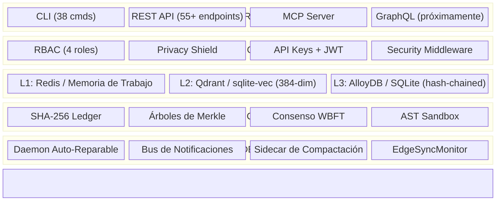

🌐 [English](README.md) | **Español** | [中文](README.zh.md)

# CORTEX — Infraestructura de Confianza para IA Autónoma

> **Verificación criptográfica, trazabilidad de auditoría y cumplimiento del EU AI Act para la memoria de agentes IA.**
> *La capa que demuestra que las decisiones de tus agentes son verdaderas.*


[](https://codecov.io/gh/borjamoskv/cortex)


[](https://cortexpersist.dev)
[](https://cortexpersist.com)
[](docs/cross_platform_guide.md)

---

## El Problema

Los agentes de IA toman millones de decisiones al día. Pero **¿quién verifica que esas decisiones son correctas?**

- **Mem0** almacena lo que los agentes recuerdan. Pero ¿puedes demostrar que la memoria no fue manipulada?
- **Zep** construye grafos de conocimiento. Pero ¿puedes auditar la cadena completa de razonamiento?
- **Letta** gestiona el estado del agente. Pero ¿puedes generar un informe de cumplimiento para los reguladores?

El **EU AI Act (Artículo 12, aplicable desde agosto 2026)** requiere:

- ✅ Registro automático de todas las decisiones del agente
- ✅ Almacenamiento a prueba de manipulaciones
- ✅ Trazabilidad y explicabilidad completas
- ✅ Verificación periódica de integridad

**Multas: hasta 30M€ o el 6% de la facturación global.**

## La Solución

CORTEX no reemplaza tu capa de memoria — la **certifica**.

```
Tu Capa de Memoria (Mem0 / Zep / Letta / Custom)
        ↓
   CORTEX Trust Engine v8
        ├── Ledger encadenado por hash SHA-256
        ├── Checkpoints con árboles de Merkle
        ├── Consenso WBFT ponderado por reputación
        ├── Privacy Shield (detección de 11 patrones de secretos)
        ├── AST Sandbox (ejecución segura de código LLM)
        └── Informes de cumplimiento EU AI Act
```

### Capacidades Principales

| Capacidad | Qué Hace | EU AI Act |
|:---|:---|:---:|
| 🔗 **Ledger Inmutable** | Cada hecho se encadena con hash SHA-256. Manipulación = detectable. | Art. 12.3 |
| 🌳 **Checkpoints Merkle** | Verificación periódica por lotes de la integridad del ledger | Art. 12.4 |
| 📋 **Registro de Auditoría** | Log con marca temporal y verificación hash de todas las decisiones | Art. 12.1 |
| 🔍 **Linaje de Decisiones** | Rastrea cómo un agente llegó a cualquier conclusión | Art. 12.2d |
| 🤝 **Consenso WBFT** | Verificación multi-agente tolerante a fallos bizantinos | Art. 14 |
| 📊 **Informe de Cumplimiento** | Snapshot de preparación regulatoria con un solo comando | Art. 12 |
| 🧠 **Memoria Tripartita** | L1 Trabajo → L2 Vectorial → L3 Ledger Episódico | — |
| 🔐 **Privacy Shield** | Filtro de ingreso sin fugas — 11 patrones de secretos | — |
| 🏠 **Local-First** | SQLite. Sin nube obligatoria. Tus datos, tu máquina. | — |
| ☁️ **Sovereign Cloud** | Multi-tenant AlloyDB + Qdrant + Redis (v6) | — |

---

## Inicio Rápido

### Instalar

```bash
pip install cortex-memory
```

### Almacenar una Decisión y Verificarla

```bash
# Almacenar un hecho (detecta automáticamente la fuente del agente IA)
cortex store --type decision --project my-agent "Chose OAuth2 PKCE for auth"

# Verificar su integridad criptográfica
cortex verify 42
# → ✅ VERIFIED — Hash chain intact, Merkle sealed

# Generar informe de cumplimiento
cortex compliance-report
# → Compliance Score: 5/5 — All Article 12 requirements met
```

### Multi-Tenant (v8)

```python
from cortex import CortexEngine

engine = CortexEngine()

# Todas las operaciones ahora están delimitadas por tenant
await engine.store_fact(
    content="Approved loan application #443",
    fact_type="decision",
    project="fintech-agent",
    tenant_id="enterprise-customer-a"
)
```

### Ejecutar como Servidor MCP (Plugin Universal para IDE)

```bash
# Compatible con: Claude Code, Cursor, OpenClaw, Windsurf, Antigravity
python -m cortex.mcp
```

### Ejecutar como API REST

```bash
uvicorn cortex.api:app --port 8484
```

---

## Arquitectura (v8 — Sovereign Cloud)



> 📐 Detalles completos de la arquitectura en [ARCHITECTURE.md](ARCHITECTURE.md) y [docs](https://cortexpersist.dev/architecture/).

---

## Panorama Competitivo

| | **CORTEX** | Mem0 | Zep | Letta | RecordsKeeper |
|:---|:---:|:---:|:---:|:---:|:---:|
| **Ledger Criptográfico** | ✅ | ❌ | ❌ | ❌ | ✅ (blockchain) |
| **Checkpoints Merkle** | ✅ | ❌ | ❌ | ❌ | ❌ |
| **Consenso Multi-Agente** | ✅ WBFT | ❌ | ❌ | ❌ | ❌ |
| **Privacy Shield** | ✅ 11 patrones | ❌ | ❌ | ❌ | ❌ |
| **AST Sandbox** | ✅ | ❌ | ❌ | ❌ | ❌ |
| **Local-First** | ✅ | ❌ | ❌ | ✅ | ❌ |
| **Sin Overhead de Blockchain** | ✅ | — | — | — | ❌ |
| **MCP Nativo** | ✅ | ❌ | ❌ | ❌ | ❌ |
| **Multi-Tenant (v6)** | ✅ | ❌ | ✅ | ❌ | ❌ |
| **Preparado para EU AI Act** | ✅ | ❌ | ❌ | ❌ | Parcial |
| **Coste** | **Gratis** | $249/mes | $$$ | Gratis | $$$ |

---

## Estadísticas (2026-02-24)

| Métrica | Valor |
|:---|:---|
| Funciones de test | **1.162+** |
| LOC en producción | **~45.500** |
| Módulos Python | **444** |
| Versión de Python | **3.10+** |

---

## Integraciones

CORTEX se conecta a tu stack existente:

- **IDEs**: Claude Code, Cursor, OpenClaw, Windsurf, Antigravity (vía MCP)
- **Frameworks de Agentes**: LangChain, CrewAI, AutoGen, Google ADK
- **Capas de Memoria**: Se sitúa sobre Mem0, Zep, Letta como capa de verificación
- **Bases de Datos**: SQLite (local), AlloyDB, PostgreSQL, Turso (edge)
- **Vector Stores**: sqlite-vec (local), Qdrant (auto-alojado o cloud)
- **Despliegue**: Docker, Kubernetes (Helm previsto Q2 2026), bare metal, `pip install`

---

## Multiplataforma

CORTEX funciona de forma nativa en cualquier entorno sin Docker:

- **macOS** (launchd y notificaciones osascript)
- **Linux** (systemd y notify-send)
- **Windows** (Task Scheduler y PowerShell)

Consulta la [Guía de Arquitectura Multiplataforma](docs/cross_platform_guide.md).

---

## Licencia

**Apache License 2.0** — Libre para cualquier uso, comercial o no comercial.
Uso gratuito para desarrollo y entornos no productivos. Se convierte en Apache 2.0 el 01-01-2030.
Consulta [LICENSE](LICENSE) para más detalles.

---

*Creado por [Borja Moskv](https://github.com/borjamoskv) · [cortexpersist.com](https://cortexpersist.com)*
