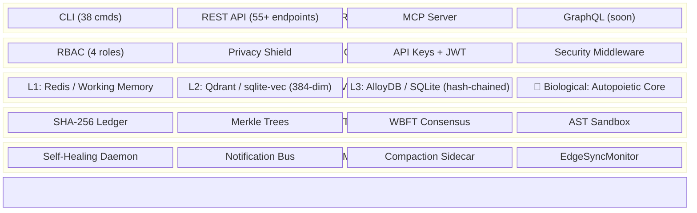

🌐 **English** | [Español](README.es.md) | [中文](README.zh.md)

# CORTEX — Trust Infrastructure for Autonomous AI

> **Cryptographic verification, audit trails, and EU AI Act compliance for AI agent memory.**
> *CORTEX is to AI memory what SSL/TLS is to web communications.*


[](https://codecov.io/gh/borjamoskv/cortex)


[](https://cortexpersist.dev)
[](https://cortexpersist.com)
[](docs/cross_platform_guide.md)

---

## The Problem

AI agents are making millions of decisions per day. But **who verifies those decisions are correct?**

- **Mem0** stores what agents remember. But can you prove the memory wasn't tampered with?
- **Zep** builds knowledge graphs. But can you audit the full chain of reasoning?
- **Letta** manages agent state. But can you generate a compliance report for regulators?

The **EU AI Act (Article 12, enforced August 2026)** requires:

- ✅ Automatic logging of all agent decisions
- ✅ Tamper-proof storage of decision records
- ✅ Full traceability and explainability
- ✅ Periodic integrity verification

**Fines: up to €30M or 6% of global revenue.**

## The Solution

CORTEX doesn't replace your memory layer — it **certifies** it.

```
Your Memory Layer (Mem0 / Zep / Letta / Custom)
        ↓
   CORTEX Trust Engine v7
        ├── 🧬 Biological Core (Autopoiesis/Endocrine)
        ├── 🛡️ Zero-Trust Guards (Connection/Storage)
        ├── 🔗 SHA-256 hash-chained ledger
        ├── Merkle tree checkpoints
        ├── Reputation-weighted WBFT consensus
        ├── Privacy Shield (11-pattern secret detection)
        ├── AST Sandbox (safe LLM code execution)
        └── EU AI Act compliance reports
```

### Core Capabilities

| Capability | What It Does | EU AI Act |
|:---|:---|:---:|
| 🔗 **Immutable Ledger** | Every fact is SHA-256 hash-chained. Tamper = detectable. | Art. 12.3 |
| 🌳 **Merkle Checkpoints** | Periodic batch verification of ledger integrity | Art. 12.4 |
| 📋 **Audit Trail** | Timestamped, hash-verified log of all decisions | Art. 12.1 |
| 🔍 **Decision Lineage** | Trace how an agent arrived at any conclusion | Art. 12.2d |
| 🤝 **WBFT Consensus** | Multi-agent Byzantine fault-tolerant verification | Art. 14 |
| 📊 **Compliance Report** | One-command regulatory readiness snapshot | Art. 12 |
| 🧠 **Tripartite Memory** | L1 Working → L2 Vector → L3 Episodic Ledger | — |
| 🧬 **Biological Core** | Autopoiesis + Endocrine + Circadian Cycles | — |
| 🔐 **Privacy Shield** | Zero-leakage ingress guard — 11 secret patterns | — |
| 🏠 **Local-First** | SQLite. No cloud required. Your data, your machine. | — |
| ☁️ **Sovereign Cloud** | Multi-tenant AlloyDB + Qdrant + Redis (v6) | — |

---

## Quick Start

### Install

```bash
pip install cortex-memory
```

### Store a Decision & Verify It

```bash
# Store a fact (auto-detects AI agent source)
cortex store --type decision --project my-agent "Chose OAuth2 PKCE for auth"

# Verify its cryptographic integrity
cortex verify 42
# → ✅ VERIFIED — Hash chain intact, Merkle sealed

# Generate compliance report
cortex compliance-report
# → Compliance Score: 5/5 — All Article 12 requirements met
```

### Multi-Tenant (v8)

```python
from cortex import CortexEngine

engine = CortexEngine()

# All operations are now tenant-scoped
await engine.store_fact(
    content="Approved loan application #443",
    fact_type="decision",
    project="fintech-agent",
    tenant_id="enterprise-customer-a"
)
```

### Run as MCP Server (Universal IDE Plugin)

```bash
# Works with: Claude Code, Cursor, OpenClaw, Windsurf, Antigravity
python -m cortex.mcp
```

### Run as REST API

```bash
uvicorn cortex.api:app --port 8484
```

---

## Architecture (v8 — Sovereign Cloud)



> 📐 Full architecture details in [ARCHITECTURE.md](ARCHITECTURE.md) and [docs](https://cortexpersist.dev/architecture/).

---

## Competitive Landscape

| | **CORTEX** | Mem0 | Zep | Letta | RecordsKeeper |
|:---|:---:|:---:|:---:|:---:|:---:|
| **Cryptographic Ledger** | ✅ | ❌ | ❌ | ❌ | ✅ (blockchain) |
| **Merkle Checkpoints** | ✅ | ❌ | ❌ | ❌ | ❌ |
| **Multi-Agent Consensus** | ✅ WBFT | ❌ | ❌ | ❌ | ❌ |
| **Privacy Shield** | ✅ 11 patterns | ❌ | ❌ | ❌ | ❌ |
| **AST Sandbox** | ✅ | ❌ | ❌ | ❌ | ❌ |
| **Local-First** | ✅ | ❌ | ❌ | ✅ | ❌ |
| **No Blockchain Overhead** | ✅ | — | — | — | ❌ |
| **MCP Native** | ✅ | ❌ | ❌ | ❌ | ❌ |
| **Multi-Tenant (v6)** | ✅ | ❌ | ✅ | ❌ | ❌ |
| **EU AI Act Ready** | ✅ | ❌ | ❌ | ❌ | Partial |
| **Cost** | **Free** | $249/mo | $$$ | Free | $$$ |

---

## Stats (2026-02-24)

| Metric | Value |
|:---|:---|
| Test functions | **1,162+** |
| Production LOC | **~45,500** |
| Python Modules | **444** |
| Python version | **3.10+** |

---

## Integrations

CORTEX plugs into your existing stack:

- **IDEs**: Claude Code, Cursor, OpenClaw, Windsurf, Antigravity (via MCP)
- **Agent Frameworks**: LangChain, CrewAI, AutoGen, Google ADK
- **Memory Layers**: Sits on top of Mem0, Zep, Letta as verification layer
- **Databases**: SQLite (local), AlloyDB, PostgreSQL, Turso (edge)
- **Vector Stores**: sqlite-vec (local), Qdrant (self-hosted or cloud)
- **Deployment**: Docker, Kubernetes (Helm coming Q2 2026), bare metal, `pip install`

---

## Cross-Platform

CORTEX runs natively on any environment without Docker:

- **macOS** (launchd & osascript notifications)
- **Linux** (systemd & notify-send)
- **Windows** (Task Scheduler & PowerShell)

See [Cross-Platform Architecture Guide](docs/cross_platform_guide.md).

---

## License

**Apache License 2.0** — Free for any use, commercial or non-commercial.
See [LICENSE](LICENSE) for details.

---

*Built by [Borja Moskv](https://github.com/borjamoskv) · [cortexpersist.com](https://cortexpersist.com)*
