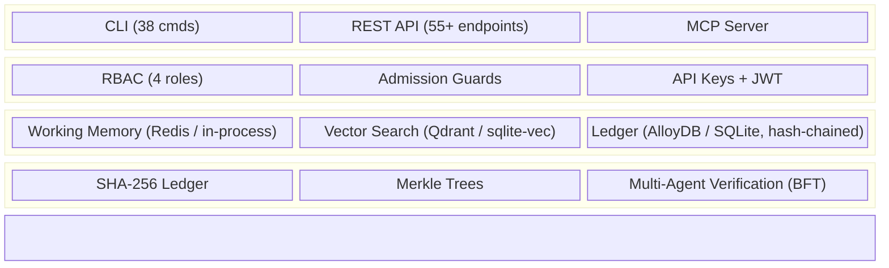

# CORTEX — Tamper-Evident Decision Lineage for AI Systems

🌐 **English** | [Español](README.es.md) | [中文](README.zh.md)

> Your AI systems make decisions.
> CORTEX makes those decisions **traceable, verifiable, and auditable**.
>
> *Hash-chained logs, Merkle integrity proofs, and queryable decision lineage
> for regulated and high-risk AI workflows.*

Package: `cortex-persist v0.3.0b1` · Engine: `v8` · License: `Apache-2.0`


[](https://codecov.io/gh/borjamoskv/cortex)


[](https://cortexpersist.dev)
[](https://cortexpersist.com)
[](docs/cross_platform_guide.md)

---

## Why It Exists

AI systems fail silently in one critical dimension: **evidence**.

- You can store memories, but not prove they were unmodified.
- You can replay outputs, but not reconstruct decision lineage.
- You can log activity, but not verify integrity across time.

CORTEX doesn't replace your memory layer — it **certifies** it.

*It is to AI memory what SSL/TLS is to web communications:
cryptographic verification, audit trails, and traceability.*

---

## What It Is

Three layers on top of your existing memory stack:

### 1. Evidence Layer

Tamper-evident record of every agent decision.

- **SHA-256 hash-chained ledger** — modification is detectable
- **Merkle tree checkpoints** — periodic batch integrity proofs
- **Tenant-scoped storage** — decisions are isolated per customer

### 2. Decision Lineage Layer

Queryable trace from any conclusion back to its origin.

- **Full causal chain** — which facts led to which decisions
- **Timestamped audit trail** — when, what, and by which agent
- **Semantic search** — find related decisions by meaning (384-dim vectors)

### 3. Governance Layer

Policy enforcement and compliance-supportive reporting.

- **Admission guards** — validate decisions before persistence
- **Secret detection** — API keys, tokens, and PII blocked at ingress
- **Compliance exports** — generate audit-ready reports on demand
- **Integrity verification** — verify ledger consistency with one command

---

## Quick Demo

```bash
# Store a decision with cryptographic proof
$ cortex store --type decision --project fin-agent "Approved loan #4292"
[+] Fact stored. Ledger hash: 8f4a2b9e...

# Verify the record was not tampered with
$ cortex verify 8f4a2b9e
[✔] VERIFIED: Hash chain intact. Merkle root sealed.

# Generate an audit report
$ cortex compliance-report
```

---

## Where It Fits

```text
Your Memory Stack (Mem0 / Zep / Letta / Custom)
        ↓
   CORTEX Evidence Layer
        ├── Hash-chained ledger
        ├── Merkle checkpoints
        ├── Admission guards
        └── Audit trail & lineage queries
```

CORTEX is not a memory store. It is the verification and traceability layer
that sits on top of any memory store.

---

## Who It Is For

| Use CORTEX if | Do not use CORTEX if |
|:---|:---|
| You need verifiable decision records | You only need semantic recall |
| You operate in regulated or high-risk workflows | You don't care about integrity proofs |
| Multiple agents share memory and need consistent lineage | A simple vector store already solves your problem |
| You need defensible audit trails for compliance or legal review | Your agents make no persistent decisions |

**Built for:**
- AI platform teams building agent infrastructure
- Regulated SaaS vendors (fintech, healthtech, insurtech)
- Enterprise copilot teams with audit requirements
- Multi-agent systems that need postmortem-capable traceability

---

## Use Cases

| Vertical | What CORTEX Provides |
|:---|:---|
| **Fintech / Insurtech** | Traceable underwriting decisions, verifiable loan approvals |
| **Healthcare** | Audit trail for clinical decision support agents |
| **Enterprise Copilots** | Evidence of what was remembered, recommended, and revised |
| **Multi-Agent Ops** | Decision lineage + postmortem verification across agent swarms |
| **EU-Regulated Deployments** | Traceability support for high-risk AI system obligations |

---

## Install

```bash
pip install cortex-persist
```

### Python API

```python
from cortex import CortexEngine

engine = CortexEngine()

await engine.store_fact(
    content="Approved loan application #443",
    fact_type="decision",
    project="fintech-agent",
    tenant_id="enterprise-customer-a"
)
```

### MCP Server (Universal IDE Plugin)

```bash
# Works with: Claude Code, Cursor, OpenClaw, Windsurf, Antigravity
python -m cortex.mcp
```

### REST API

```bash
uvicorn cortex.api:app --port 8484
```

---

## Architecture


```mermaid
block-beta
  columns 1

  block:INTERFACES["INTERFACES"]
    CLI["CLI (38 cmds)"]
    API["REST API (55+ endpoints)"]
    MCP["MCP Server"]
  end

  block:GATEWAY["TRUST GATEWAY"]
    RBAC["RBAC (4 roles)"]
    Guards["Admission Guards"]
    Auth["API Keys + JWT"]
  end

  block:STORAGE["STORAGE"]
    L1["Working Memory (Redis / in-process)"]
    L2["Vector Search (Qdrant / sqlite-vec)"]
    L3["Ledger (AlloyDB / SQLite, hash-chained)"]
  end

  block:TRUST["VERIFICATION"]
    Ledger["SHA-256 Ledger"]
    Merkle["Merkle Trees"]
    Consensus["Multi-Agent Verification (BFT)"]
  end

  INTERFACES --> GATEWAY --> STORAGE --> TRUST
```

> Full architecture in [architecture.md](docs/architecture.md).

---

## Integrations

CORTEX plugs into your existing stack:

- **IDEs**: Claude Code, Cursor, OpenClaw, Windsurf, Antigravity (via MCP)
- **Agent Frameworks**: LangChain, CrewAI, AutoGen, Google ADK
- **Memory Layers**: Sits on top of Mem0, Zep, Letta as verification layer
- **Databases**: SQLite (local), AlloyDB, PostgreSQL, Turso (edge)
- **Vector Stores**: sqlite-vec (local), Qdrant (self-hosted or cloud)
- **Deployment**: Docker, Kubernetes, bare metal, `pip install`

---

## Cross-Platform

CORTEX runs natively on any environment without Docker:

- **macOS** (launchd & osascript notifications)
- **Linux** (systemd & notify-send)
- **Windows** (Task Scheduler & PowerShell)

See [Cross-Platform Guide](docs/cross_platform_guide.md).

---

## Regulatory Positioning

CORTEX provides the traceability, integrity verification, and audit infrastructure
that regulated environments require. It does not by itself make a system "compliant"
— compliance depends on the role, use case, and risk category of the deploying system.

What CORTEX provides:

- **Tamper-evident storage** of all agent decisions (hash-chained ledger)
- **Automatic audit trail** generation with timestamped, verifiable records
- **Integrity verification** via Merkle tree checkpoints
- **Full decision lineage** — trace any conclusion back to its origin

These capabilities support the traceability and logging requirements
described in frameworks such as the EU AI Act (Article 12), among others.

---

## Documentation

- [AGENTS.md](./AGENTS.md) — operational contract for contributors and coding agents
- [Architecture](docs/architecture.md) — topology, module map, and data flow
- [Security & Trust Model](docs/SECURITY_TRUST_MODEL.md) — trust boundaries and threat model
- [Axioms](docs/AXIOMS.md) — epistemic and design axioms
- [Contributing](./CONTRIBUTING.md) — contribution workflow
- [Security Policy](./SECURITY.md) — vulnerability disclosure
- [Roadmap](./ROADMAP.md) — development timeline

---

## License

**Apache License 2.0** — Free for any use, commercial or non-commercial.
See [LICENSE](LICENSE) for details.

---

*Built by [borjamoskv.com](https://borjamoskv.com) · [cortexpersist.com](https://cortexpersist.com)*
