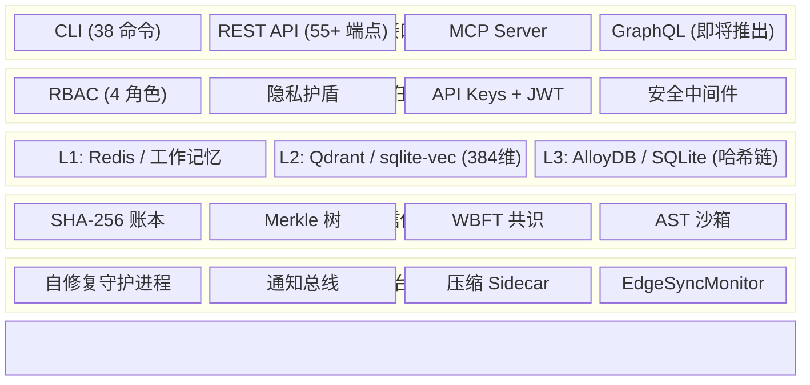

🌐 [English](README.md) | [Español](README.es.md) | **中文**

# CORTEX — 自治 AI 的信任基础设施

> **为 AI 代理记忆提供密码学验证、审计追踪和欧盟 AI 法案合规支持。**
> *证明你的代理决策可信的那一层。*


[](https://codecov.io/gh/borjamoskv/cortex)


[](https://cortexpersist.dev)
[](https://cortexpersist.com)
[](docs/cross_platform_guide.md)

---

## 问题

AI 代理每天做出数百万个决策。但**谁来验证这些决策是正确的？**

- **Mem0** 存储代理的记忆。但你能证明记忆没有被篡改吗？
- **Zep** 构建知识图谱。但你能审计完整的推理链吗？
- **Letta** 管理代理状态。但你能为监管机构生成合规报告吗？

**欧盟 AI 法案（第 12 条，2026 年 8 月起执行）** 要求：

- ✅ 自动记录所有代理决策
- ✅ 防篡改的决策记录存储
- ✅ 完整的可追溯性和可解释性
- ✅ 定期完整性验证

**罚款：最高 3000 万欧元或全球收入的 6%。**

## 解决方案

CORTEX 不是替代你的记忆层——而是为其提供**认证**。

```
你的记忆层 (Mem0 / Zep / Letta / 自定义)
        ↓
   CORTEX Trust Engine v8
        ├── SHA-256 哈希链账本
        ├── Merkle 树检查点
        ├── 信誉加权 WBFT 共识
        ├── 隐私护盾（11 种密钥模式检测）
        ├── AST 沙箱（安全的 LLM 代码执行）
        └── 欧盟 AI 法案合规报告
```

### 核心能力

| 能力 | 功能 | EU AI Act |
|:---|:---|:---:|
| 🔗 **不可变账本** | 每条事实通过 SHA-256 哈希链接。篡改 = 可检测。 | Art. 12.3 |
| 🌳 **Merkle 检查点** | 定期批量验证账本完整性 | Art. 12.4 |
| 📋 **审计追踪** | 带时间戳和哈希验证的所有决策日志 | Art. 12.1 |
| 🔍 **决策谱系** | 追踪代理如何得出任何结论 | Art. 12.2d |
| 🤝 **WBFT 共识** | 多代理拜占庭容错验证 | Art. 14 |
| 📊 **合规报告** | 一条命令生成监管就绪快照 | Art. 12 |
| 🧠 **三层记忆** | L1 工作记忆 → L2 向量记忆 → L3 情景账本 | — |
| 🔐 **隐私护盾** | 零泄漏入口守卫 — 11 种密钥模式 | — |
| 🏠 **本地优先** | SQLite。无需云服务。你的数据，你的机器。 | — |
| ☁️ **主权云** | 多租户 AlloyDB + Qdrant + Redis (v6) | — |

---

## 快速开始

### 安装

```bash
pip install cortex-memory
```

### 存储决策并验证

```bash
# 存储一条事实（自动检测 AI 代理来源）
cortex store --type decision --project my-agent "Chose OAuth2 PKCE for auth"

# 验证其密码学完整性
cortex verify 42
# → ✅ VERIFIED — Hash chain intact, Merkle sealed

# 生成合规报告
cortex compliance-report
# → Compliance Score: 5/5 — All Article 12 requirements met
```

### 多租户 (v8)

```python
from cortex import CortexEngine

engine = CortexEngine()

# 所有操作现在都按租户隔离
await engine.store_fact(
    content="Approved loan application #443",
    fact_type="decision",
    project="fintech-agent",
    tenant_id="enterprise-customer-a"
)
```

### 作为 MCP 服务器运行（通用 IDE 插件）

```bash
# 支持：Claude Code, Cursor, OpenClaw, Windsurf, Antigravity
python -m cortex.mcp
```

### 作为 REST API 运行

```bash
uvicorn cortex.api:app --port 8484
```

---

## 架构 (v8 — 主权云)



> 📐 完整架构详情见 [ARCHITECTURE.md](ARCHITECTURE.md) 和 [文档](https://cortexpersist.dev/architecture/)。

---

## 竞争格局

| | **CORTEX** | Mem0 | Zep | Letta | RecordsKeeper |
|:---|:---:|:---:|:---:|:---:|:---:|
| **密码学账本** | ✅ | ❌ | ❌ | ❌ | ✅ (区块链) |
| **Merkle 检查点** | ✅ | ❌ | ❌ | ❌ | ❌ |
| **多代理共识** | ✅ WBFT | ❌ | ❌ | ❌ | ❌ |
| **隐私护盾** | ✅ 11 种模式 | ❌ | ❌ | ❌ | ❌ |
| **AST 沙箱** | ✅ | ❌ | ❌ | ❌ | ❌ |
| **本地优先** | ✅ | ❌ | ❌ | ✅ | ❌ |
| **无区块链开销** | ✅ | — | — | — | ❌ |
| **原生 MCP** | ✅ | ❌ | ❌ | ❌ | ❌ |
| **多租户 (v6)** | ✅ | ❌ | ✅ | ❌ | ❌ |
| **EU AI Act 就绪** | ✅ | ❌ | ❌ | ❌ | 部分 |
| **费用** | **免费** | $249/月 | $$$ | 免费 | $$$ |

---

## 统计数据 (2026-02-24)

| 指标 | 数值 |
|:---|:---|
| 测试函数 | **1,162+** |
| 生产代码行数 | **~45,500** |
| Python 模块 | **444** |
| Python 版本 | **3.10+** |

---

## 集成

CORTEX 可接入你现有的技术栈：

- **IDE**: Claude Code, Cursor, OpenClaw, Windsurf, Antigravity（通过 MCP）
- **代理框架**: LangChain, CrewAI, AutoGen, Google ADK
- **记忆层**: 作为验证层叠加在 Mem0, Zep, Letta 之上
- **数据库**: SQLite（本地）, AlloyDB, PostgreSQL, Turso（边缘）
- **向量存储**: sqlite-vec（本地）, Qdrant（自托管或云端）
- **部署**: Docker, Kubernetes（Helm 计划 2026 Q2）, 裸机, `pip install`

---

## 跨平台

CORTEX 无需 Docker 即可在任何环境原生运行：

- **macOS**（launchd 和 osascript 通知）
- **Linux**（systemd 和 notify-send）
- **Windows**（任务计划程序和 PowerShell）

详见[跨平台架构指南](docs/cross_platform_guide.md)。

---

## 许可证

**Business Source License 1.1** (BSL-1.1)。
非生产和开发用途免费。2030 年 1 月 1 日自动转换为 Apache 2.0。
详情见 [LICENSE](LICENSE)。

---

*由 [Borja Moskv](https://github.com/borjamoskv) 开发 · [cortexpersist.com](https://cortexpersist.com)*
