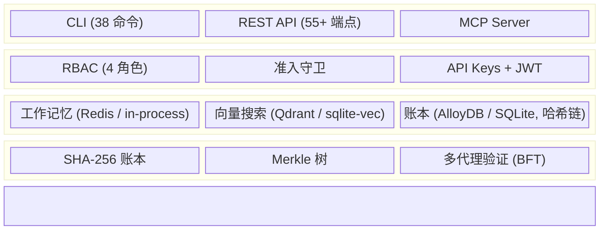

🌐 [English](README.md) | [Español](README.es.md) | **中文**

# CORTEX Persist

面向高风险 AI 工作流的可验证记忆与决策溯源。

CORTEX Persist 为将 AI 部署到高风险工作流的团队提供可验证记忆、防篡改决策溯源和可导出证据。它提供哈希链记录和验证命令，让团队可以检查发生了什么，而不是事后重建。

包：`cortex-persist v0.3.0b3` · 引擎：`v8` · 许可证：`Apache-2.0`


[](https://codecov.io/gh/borjamoskv/Cortex-Persist)


[](https://github.com/borjamoskv/Cortex-Persist/tree/main/docs)
[](https://cortexpersist.com)
[](docs/cross_platform_guide.md)

---

## 为什么存在

当 AI 系统进入真实工作流时，单纯的日志已经不够。

- 你可以保存记忆，但很难验证记录之后是否被改动。
- 你可以重放输出，但很难说明决策是如何形成的。
- 你可以收集事件，但很难在需要时导出可检查的证据。

CORTEX 不替代你的记忆层。它在现有栈之上增加验证、防篡改谱系和证据导出能力。

---

## 它是什么

CORTEX Persist 适合那些把 AI 放进真实工作流、而平面日志又不够的团队。

- **结构化事实与决策** — 以可检查的形式保存关键状态
- **防篡改账本** — 通过哈希链和 Merkle 检查点检测改动
- **需要证据时再验证** — 用验证命令检查连续性与完整性
- **可导出证据** — 为审查、事故响应和审计流程生成可分享的产物

它与现有数据库、observability 和向量检索并存，而不是替代它们。

---

## 快速演示

```bash
# 存储一个带密码学证明的决策
$ cortex store fin-agent "Approved loan #4292" --type decision
[+] Fact stored. Ledger hash: 8f4a2b9e...

# 验证记录未被篡改
$ cortex verify 8f4a2b9e
[✔] VERIFIED: Hash chain intact. Merkle root sealed.

# 生成审计报告
$ cortex compliance-report
```

---

## 在哪里使用

```text
你的记忆栈 (Mem0 / Zep / Letta / 自定义)
        ↓
   CORTEX 证据层
        ├── 哈希链账本
        ├── Merkle 检查点
        ├── 准入守卫
        └── 审计追踪和溯源查询
```

CORTEX 不是一个记忆数据库。它是叠加在现有记忆栈之上的
验证层和决策溯源层。

---

## 适合谁

| 使用 CORTEX 如果 | 不要使用 CORTEX 如果 |
|:---|:---|
| 你需要可验证的记忆与决策记录 | 你只需要语义检索 |
| 代理会执行不可逆操作 | 你不关心完整性或可追溯性 |
| 多个代理共享状态并需要可检查的溯源 | 简单的向量存储已经足够 |
| 你需要事后可辩护的记录 | 你的代理不做持久化决策 |

**专为以下团队构建：**
- 构建代理基础设施的 AI 平台团队
- 负责支持、审批、定价、金融或合规流程的团队
- 需要可检查决策记录的企业 Copilot 团队
- 需要具备事后追溯能力的多代理系统

---

## 使用场景

| 行业 | CORTEX 提供什么 |
|:---|:---|
| **金融科技 / 保险科技** | 可追溯的承保决策、可验证的贷款审批 |
| **医疗健康** | 临床决策支持代理的审计追踪 |
| **企业 Copilot** | 记住了什么、推荐了什么、修改了什么的证据 |
| **多代理运维** | 跨代理集群的决策溯源 + 事后验证 |
| **高风险 AI 工作流** | 支持需要可追溯性、完整性检查和证据导出的场景 |

---

## 安装

```bash
pip install cortex-persist
```

### Python API

```python
from cortex import CortexEngine

engine = CortexEngine()

await engine.store(
    project="fintech-agent",
    content="Approved loan application #443",
    fact_type="decision",
    tenant_id="enterprise-customer-a"
)
```

### MCP 服务器（通用 IDE 插件）

```bash
# 支持：Claude Code, Cursor, OpenClaw, Windsurf, Antigravity
python -m cortex.mcp
```

### REST API

```bash
uvicorn cortex.api:app --port 8484
```

---

## 架构


```mermaid
block-beta
  columns 1

  block:INTERFACES["接口层"]
    CLI["CLI (38 命令)"]
    API["REST API (55+ 端点)"]
    MCP["MCP Server"]
  end

  block:GATEWAY["信任网关"]
    RBAC["RBAC (4 角色)"]
    Guards["准入守卫"]
    Auth["API Keys + JWT"]
  end

  block:STORAGE["存储层"]
    L1["工作记忆 (Redis / in-process)"]
    L2["向量搜索 (Qdrant / sqlite-vec)"]
    L3["账本 (AlloyDB / SQLite, 哈希链)"]
  end

  block:TRUST["验证层"]
    Ledger["SHA-256 账本"]
    Merkle["Merkle 树"]
    Consensus["多代理验证 (BFT)"]
  end

  INTERFACES --> GATEWAY --> STORAGE --> TRUST
```

> 完整架构详见 [ARCHITECTURE.md](docs/ARCHITECTURE.md)。

---

## 集成

CORTEX 可接入你现有的技术栈：

- **IDE**：Claude Code, Cursor, OpenClaw, Windsurf, Antigravity（通过 MCP）
- **代理框架**：LangChain, CrewAI, AutoGen, Google ADK
- **记忆层**：作为验证层叠加在 Mem0, Zep, Letta 之上
- **数据库**：SQLite（本地）, AlloyDB, PostgreSQL, Turso（边缘）
- **向量存储**：sqlite-vec（本地）, Qdrant（自托管或云端）
- **部署**：Docker, Kubernetes, 裸机, `pip install`

---

## 跨平台

CORTEX 无需 Docker 即可在任何环境原生运行：

- **macOS**（launchd 和 osascript 通知）
- **Linux**（systemd 和 notify-send）
- **Windows**（任务计划程序和 PowerShell）

详见[跨平台指南](docs/cross_platform_guide.md)。

---

## 安全与信任边界

CORTEX 提供可验证记忆、防篡改溯源和可导出证据。
它本身不会自动让系统“合规”——是否合规仍取决于部署环境、策略、审查流程和具体用例。

CORTEX 支持的能力包括：

- **防篡改账本** — 所有关键写入都会进入哈希链连续性模型
- **完整性验证** — 通过验证命令和 Merkle 检查点检查一致性
- **决策溯源** — 让团队回看关键状态如何进入持久层
- **可导出证据** — 为审查、事故响应和审计流程提供可分享产物

这些能力可支持受监管环境中的可追溯性、完整性检查和记录保存需求，
但不应被表述为监管认证本身。

---

## 许可证

**Apache License 2.0** — 任何用途均免费，商业或非商业。
详情见 [LICENSE](LICENSE)。

---

*由 [borjamoskv.com](https://borjamoskv.com) 开发 · [cortexpersist.com](https://cortexpersist.com)*
