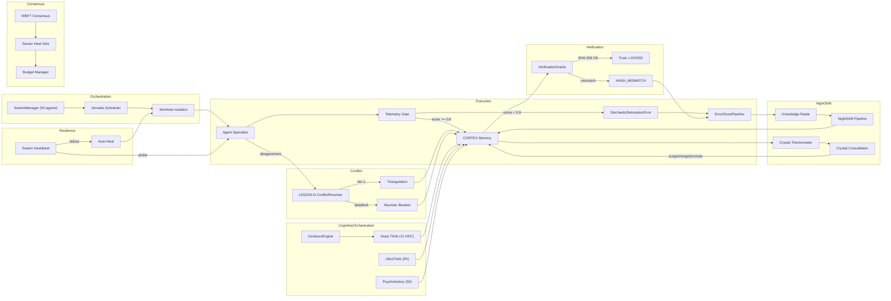
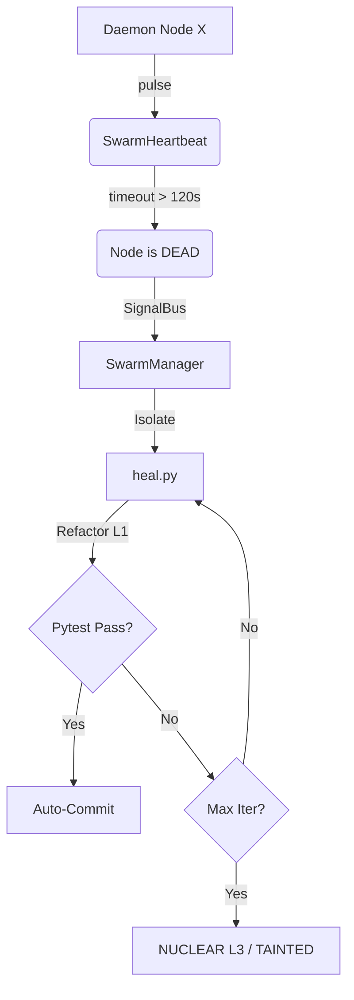
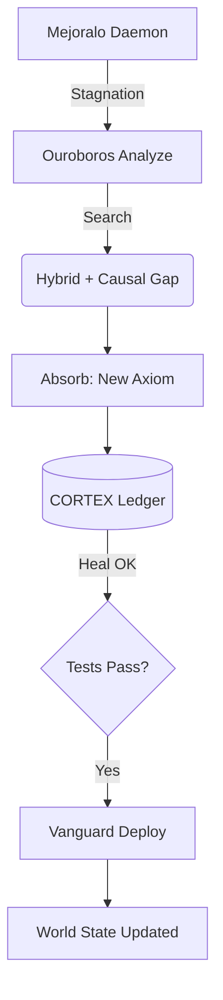
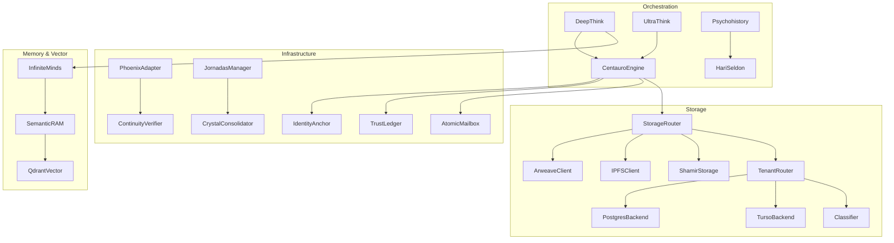

# CORTEX Swarm Architecture

> "A swarm without a manager is thermal noise. A swarm with a Sovereign Manager is a directed thermodynamic engine."
> — CORTEX Axiom Ω₁₃

CORTEX Persist operates a multi-agent execution topology designed to minimize epistemic collision through **Structural Isolation**, **Thermodynamic Management**, **Autonomous Crystallization**, and **Byzantine Consensus**.

---

## Lifecycle Diagram



---

## 1. Orchestration & Isolation

### 1.1 SwarmManager (`cortex/extensions/swarm/manager.py`)

Supervisor termodinámico del nodo local:

- Mide ramas efímeras (`WorktreeState`) en estado **active**, **provisioning** o **failed**.
- Resuelve deadlocks emitiendo `/trigger-jornada` (Jornadas de Convivencia).
- Monitorea Exergy para que picos estocásticos no consuman CPU/GPU de forma descontrolada.

### 1.2 Worktree Isolation (`cortex/extensions/swarm/worktree_isolation.py`)

Aislamiento físico Git via jaulas efímeras (`git worktree`).

```python
async with isolated_worktree("main") as worktree_path:
    await agent.execute(cwd=worktree_path)
# Al salir: destrucción determinística garantizada
```

**Ciclo de Vida:**

1. **Creation**: `git worktree add -b <ephemeral_branch>` + identidad Git del agente. Emite `worktree:created`.
2. **Yield**: Control cedido al especialista en directorio físico separado.
3. **Destruction**: `git worktree remove --force` + `shutil.rmtree` + borrado de rama. Si queda residuo → `worktree:residue_detected`.

Protecciones: timeout 30s por comando Git, restauración de `cwd`, `cleanup_all_worktrees()` concurrente O(1).

### 1.3 SwarmProtocols (`cortex/extensions/swarm/protocols.py`)

Interfaces `Protocol` (PEP 544) que definen el contrato mínimo del Enjambre:

- `SwarmExtension`: `get_status()` + `evict_stale_data()`.
- `SwarmModule`: `name`, `initialize()`, `shutdown()`.

Structural subtyping — no herencia explícita requerida.

---

## 2. Resilience (Heartbeat & Auto-Heal)

### 2.1 Swarm Heartbeat (`cortex/extensions/swarm/swarm_heartbeat.py`)

Detección de fallos vitales O(1) con tiempos monotónicos:

1. **Emisión de Pulso**: Cada daemon emite `.pulse()` en su ciclo.
2. **Transición**: Sin pulso → `SUSPECT` → excede threshold → `DEAD`.
3. **Circuit Breaker**: Estado `DEAD` emite `node:dead` al `SignalBus`.

### 2.2 Auto-Heal (`cortex/extensions/mejoralo/heal.py`)

Curación Bizantina escalonada:

- **L1 (NORMAL)**: Fix estándar.
- **L2 (AGRESIVO)**: Refactorización test-driven forzada.
- **L3 (NUCLEAR)**: Código declarado `TAINTED`, escalado a especialistas topológicos.



### 2.3 ErrorGhostPipeline (`cortex/extensions/swarm/error_ghost_pipeline.py`)

Toda excepción no capturada se persiste como ghost fact. El sistema no muere en silencio.

- **Ring-Buffer Dedup**: LRU de 64 hashes. Hash repetido → suprimido.
- **Rate Limit**: Máx 1 ghost por source cada 60s.
- **Thread-Safe**: `threading.Lock` (compatible sync + async).
- **Fallback FS**: Si DB inalcanzable → `~/.cortex/.error_ghosts/` JSON.

### 2.4 Trend Detection (`cortex/extensions/health/trend.py`)

`TrendDetector` mide slope OLS del Health (1-10):

- Slope `> 0.5` → Enjambre **mejorando**.
- Slope `< -0.5` → **Colapso termodinámico progresivo** → Manager detiene procesos.

---

## 3. NightShift (Autonomous Crystallization)

### 3.1 NightShift Crystal Daemon (`cortex/extensions/swarm/nightshift_daemon.py`)

Genera conocimiento mientras el operador descansa. Ciclo dual-phase:

**Phase 1 — Acquisition**: `KnowledgeRadar.discover()` → `NightShiftPipeline.run()` → Cristales nuevos.

**Phase 2 — Consolidation (REM)**: `CrystalThermometer.scan_all_crystals()` → `consolidate()` → Purge/Merge/Promote.

Persistencia como `fact_type="decision"`. Cooldown 6h (`asyncio.wait_for`, zero CPU).

### 3.2 Knowledge Radar (`cortex/extensions/swarm/knowledge_radar.py`)

Descubre targets de cristalización desde 3 fuentes:

| Source | Mecanismo | Prioridad |
| :--- | :--- | :---: |
| **Curated Queue** | YAML manual (`nightshift_queue.yaml`) | 5 |
| **Ghost Gaps** | Facts tagged `knowledge_gap`/`auto_ghost` | 3 |
| **Semantic Gaps** | Proyectos con sparse L2 coverage | 7 |

Pipeline: `merge_and_prioritize(*lists, max_n=5)` → Dedup → Sort → Top-N.

### 3.3 Crystal Thermometer (`cortex/extensions/swarm/crystal_thermometer.py`)

Signos vitales de cada cristal:

- **Temperature** = `recall_count / age_days`.
- **Resonance** = Max cosine similarity contra 7 axiomas CORTEX.

| | Resonance Alta (≥ 0.5) | Resonance Baja |
| :--- | :---: | :---: |
| **Temp Alta (≥ 0.1)** | ACTIVE | NOISE |
| **Temp Baja** | FOUNDATIONAL | DEAD_WEIGHT |

**Axiomatic Inertia**: Resonance ≥ 0.8 + temp baja → temperatura elevada a 0.1 (protección contra purga).

### 3.4 Crystal Consolidator (`cortex/extensions/swarm/crystal_consolidator.py`)

Fase destructiva (REM). 4 estrategias:

| Estrategia | Condición | Efecto |
| :--- | :--- | :--- |
| **COLD_PURGE** | PURGE + age ≥ 14d + not diamond | Hard-delete fact + vector |
| **SEMANTIC_MERGE** | Cosine ≥ 0.92 | LLM fuse → update primary, delete secondary |
| **DIAMOND_PROMOTE** | PROMOTE/PROTECT + age ≥ 7d | `is_diamond = 1` (inmune a decay) |
| **RE_EMBED** | age ≥ 30d | Refresh embedding con encoder actual |

---

## 4. Consensus & Routing

### 4.1 LLM Router (`cortex/extensions/llm/router.py`)

3 membranas físicas:

- **Fallback Cascade & A-Records**: Prioriza por `intent`. Éxito → A-Record en memoria → O(1) Hot Path.
- **Thermal Heat-Sink**: SHA-256 hash de `(instruction:memory:intent)`. Peticiones 2-N esperan `asyncio.Future` de la primera. O(1).
- **Shannon Compression**: Si > 90% ventana de contexto → truncado estricto preservando Seed Instruction + Tail Messages.

### 4.2 WBFT Consensus (`cortex/consensus/byzantine.py`)

N modelos en paralelo → WBFTConsensus. Tolerancia si ≤ 1/3 alucinan:

1. **Agreement Matrix**: Jaccard distance entre respuestas → clúster mayoritario.
2. **Reputation Weights**: Historial con decaimiento matemático.
3. **Outlier Isolation**: Threshold 0.15 → `is_outlier = True`.

### 4.3 Budget Manager (`cortex/extensions/swarm/budget.py`)

Contable Soberano por `Mission ID`: input/output tokens, costo USD, count peticiones. Si espiral de curación → Manager intercede algorítmicamente.

---

## 5. Quality Gate (Telemetry)

### 5.1 Sovereign Telemetry Gate (`cortex/extensions/swarm/telemetry_gate.py`)

Membrana inmunológica: si un LLM alucina, su output **nunca toca** la memoria persistente.

```python
@sovereign_quality_gate("crystal_forge", evaluator=compose_and(
    exact_match_evaluator(["summary", "confidence"]),
    confidence_evaluator(field="confidence", min_val=0.7),
), threshold=0.8)
def forge_crystal(inputs) -> Result[Crystal, str]: ...
```

- `compose_and()`: Min score (todos pasan). `compose_or()`: Max score (uno pasa).
- **Circuit Breaker**: 3 fallos → `CircuitOpenError` → rechazo absoluto.
- **`StochasticDetonationError`**: score < threshold → abort.
- **ErrorGhostPipeline**: Fallo capturado como ghost para post-mortem.

---

## 6. Ouroboros & Deployment

### 6.1 Ouroboros Daemon (`cortex/extensions/mejoralo/daemon.py`)

Si estancamiento en calidad → Shadow Debt → Razonamiento Profundo:

1. **Analyze**: `ThoughtOrchestra` con contexto de fallas previas.
2. **Absorb** (Ω₇): Destilar UNA regla arquitectónica.
3. **Crystallize**: Regla persistida en CORTEX → restricción inmediata futura.

### 6.2 Hybrid Search (`cortex/search/hybrid.py`)

RRF (k=60) integrando BM25 + semántica O(1). Temporal Decay (λ=0.01).

### 6.3 Causal Gap Retrieval (`cortex/search/causal_gap.py`)

Reemplaza "dame resultados similares" por "dame la evidencia que más reduce incertidumbre":

**Fórmula de peso de voto (Tier 2):**

```text
weight = 0.40×domain_match + 0.30×success_rate + 0.20×confidence + 0.10×recency
```

### 6.4 Vanguard Deployment

Si Master Ledger aprueba (tests OK, Ruff OK, entropía decayendo) → deploy vía `vanguard-deployment-omega.sh` a Edge Server.



---

## 7. Conflict Resolution (`conflict_resolution.py`)

The **LEGION-Ω Protocol** resolves multi-agent disagreements without human intervention.

- **4-Tier Escalation**:
  1. **Triangulation**: A third agent analyzes the conflict.
  2. **Weighted Vote**: Agents vote based on domain reputation.
  3. **Architect Arbitration**: Escalation to a high-privileged Architect agent.
  4. **Deadlock Heuristic**: If all fails, a deterministic heuristic (e.g., preference for existing stable state) is applied.
- **Voting Weight**: `weight = 0.40×domain_match + 0.30×success_rate + 0.20×confidence + 0.10×recency`.

---

## 8. Verification Oracle (`verification.py`)

Provides a deterministic frontier for probabilistic LLM outputs.

- **SHA-256 Integrity**: Validates fact content against its cryptographic hash.
- **Ledger Verification**: Ensures the fact is anchored in the persistent ledger (Arweave/Local).
- **Batch Verification**: Optimized O(N) verification for thousands of facts using vectorized checks.

---

## 9. Cognitive Orchestration

Specialized protocols for high-complexity reasoning and simulation.

### 9.1 Deep Think (`orchestrator_deep_think.py`)
An 11-agent mesh protocol (10 specialists + 1 "Maradona" synthesizer) using **HDC (Hyperdimensional Computing)** vectors for state management. Operates on a 4D Waveform context to detect resonance and Byzantine drift.

### 9.2 UltraThink (`orchestrator_ultra_think.py`)
Handles **P0 Singularities** (system failures, security breaches) via a 3-phase gate:
1. **Proposal Generation**: Diverse solution space.
2. **Mechanical Verification**: AST validation and trace analysis of the proposal.
3. **Logic Audit**: Verification Oracle check. Failure triggers a "stochastic detonation" (proposal rejection).

### 9.3 Psychohistory (`psychohistory.py`)
A 50-agent simulation across 5 domains to model catastrophic contingencies. Uses a **Hari Seldon Omega** synthesis agent to produce an O(1) **Contingency Crystal** from the swarm's collective resonance.

### 9.4 InfiniteMinds (`infinite_minds.py`)
Manages agent "minds" as zero-copy lenses over a shared **DynamicSemanticSpace**. Uses `semantic_bias` to refract queries and detects Byzantine clusters via N² similarity calculations.

---

## 10. CentauroEngine (Swarm Core) (`centauro_engine.py`)

The tactical execution engine for the Sovereign Swarm.

- **12 Combat Formations**: Dynamic switching (e.g., `BLITZ` for speed, `LEVIATHAN` for data volume).
- **Endocrine Modulation**: Uses Adrenaline/Cortisol/Dopamine hormone types to signal mission state and urgency.
- **ALEPH-Ω Fallback**: A probabilistic leap mechanism used when consensus fails to reach a 2/3 quorum.

---

## 11. Agent Infrastructure

The low-level trust and communication foundation.

### 11.1 Cryptographic Identity (`identity.py`)

**IdentityAnchor** provides RSA-PSS 4096-bit signatures. Used for Arweave address derivation via public JWK export.

### 11.2 Trust & Attestation (`trust_scoring.py`)

**TrustLedger** manages peer attestations. Scores decay over time to prevent reputation squatting. Anchored on Arweave for third-party verification.

### 11.3 Secret Sharing (`shamir_storage.py`)

**ShamirStorage** implements k-of-n secret sharing over GF(256). Sensitive payloads are split into shares distributed across multiple backends.

### 11.4 Atomic Communication (`mailbox.py`)

**AtomicMailbox** provides zero-latency inter-agent messaging using a local SQLite backend for transactional reliability.

### 11.5 Swarm Sync (`jornadas.py`)

**JornadasManager** orchestrates "REM sleep" events. Pauses execution for global entropy reduction and axiom crystallization.

### 11.6 Agent Resurrection (`phoenix_handoff_adapter.py`)

Restores agent context by verifying Arweave continuity and pulling causal chains from the local CORTEX database.

---

## 12. Storage Layer Architecture

Unified multi-tier storage with privacy safeguards.

### 12.1 Storage Protocol (`storage/adapter.py`)

Defines the `StorageAdapter` protocol (async execute, fetch, commit) implemented by all backends.

### 12.2 Multi-Backend Router (`storage_router.py`)

High-level Swarm router with **Fallback Hierarchy**: Arweave (Permanent) → IPFS (Verifiable) → Local (Reliable). Includes a re-probe logic for degraded backends.

### 12.3 Multi-Tenancy & Privacy (`storage/router.py`)

**TenantRouter** isolates data by `tenant_id`. Features **Zero-Trust Privacy**: scans content via `classifier.py` and forces LOCAL storage if sensitive patterns (API keys, PII) are detected.

### 12.4 Database Backends

- **PostgreSQL (`postgres.py`)**: Cloud-scale storage with connection pooling and idempotent schema initialization.
- **Turso (`turso.py`)**: Edge-optimized libSQL integration for low-latency global reach.
- **Qdrant (`qdrant.py`)**: Vector store with per-tenant collection isolation.

---

## 13. Module Dependency Map


