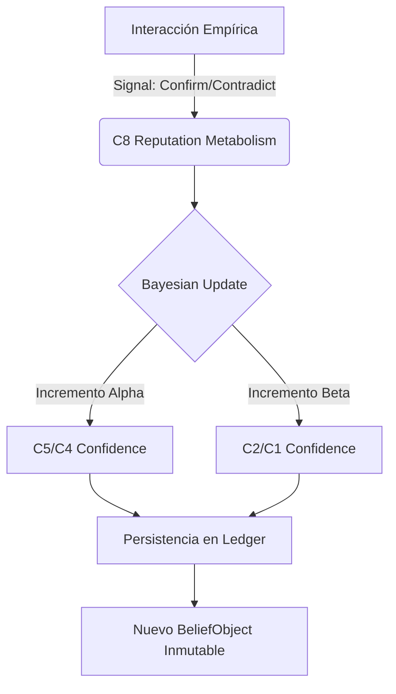

# C8 Reputation Metabolism (Exergy-Maximized)

## 1. Ontología de la Confianza (BeliefObject C8)
La confianza en agentes u operadores empíricos no es un entero estático, sino un **BeliefObject dinámico** regido por las leyes del *Bayesian Trust Updater*.

## 2. Invariante Termodinámica
Cualquier mutación en la reputación se registra como una **transacción inmutable** en el *CortexEngine* con el `fact_type = "reputation_mutation"`. 
Esta operación incurre en un coste de exergía y cristaliza la procedencia de la confianza (Provenance Chain).

## 3. Topología de Señales
- `CONFIRM`: Transacción validada BFT, entrega exitosa.
- `WEAK_CONFIRM`: Progreso parcial, ack recibido.
- `CONTRADICT`: Aserción fallida, timeout intencionado, comportamiento bizantino.
- `REPLICATE`: Dos agentes convergen en el mismo resultado sin colusión.
- `DEPRECATE`: Reputación forzosamente obliterada por el Operador o el *JIS Auditor*.
