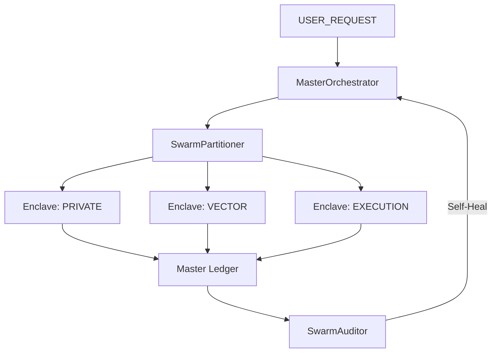

# CORTEX Multi-Swarm Architecture (Ω-Cortex)

## Overview
The Multi-Swarm architecture (introduced at Level 200) divides the computational universe into specialized **Enclaves**.

### Enclaves
1.  **PRIVATE (Enclave Alpha)**: Local-first, vault-encrypted processing. No external leaks.
2.  **VECTOR (Enclave Sigma)**: Knowledge acquisition via `Soulseek`, `Moltbook`, and `SerpAPI`.
3.  **EXECUTION (Enclave Delta)**: Action-oriented tool/skill execution.
4.  **GOVERNANCE (Enclave Omega)**: The Master Ledger and Policy Auditor.

## Operational Flow

## Performance Standards
- **Wait Time**: < 200ms (Speculative Dispatch).
- **Redundancy**: 0% (Ghost-Bypass Caching).
- **Scale**: Up to 100 parallel virtual actors.
