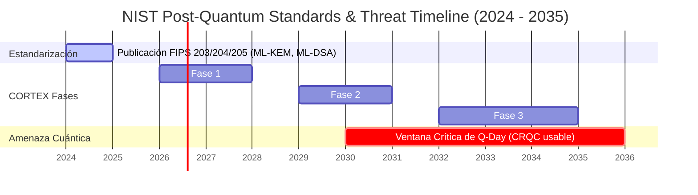

<!-- [C5-REAL] PQC Migration Plan · borjamoskv -->

# CORTEX Post-Quantum Cryptography (PQC) Migration Plan
**Author:** Borja Moskv (SYS_ID: borjamoskv)  
**Status:** Approved Draft for CORTEX-Persist  
**Classification:** Security Architecture

---

## 1. Inventario de Superficies Criptográficas Actuales

El análisis de la base de código de CORTEX (incluyendo `cortex_rs` y `babylon60/crypto`) revela las siguientes superficies criptográficas activas basadas en firmas de curva elíptica tradicionales (Ed25519 y secp256k1) vulnerables a la computación cuántica:

| Superficie Criptográfica | Ubicación en Código | Propósito / Función | Primitiva Actual | Impacto Cuántico |
| :--- | :--- | :--- | :--- | :--- |
| **Identidad de Agente (Enterprise Key Management)** | [`babylon60/crypto/keys.py`](file:///Users/borjafernandezangulo/30_CORTEX/babylon60/crypto/keys.py) | Firma de estados cognitivos antes de su persistencia en el Ledger Soberano. | `Ed25519` (cryptography) | **Crítico**: Compromiso total de firma e identidad. |
| **Identidad ZK-Swarm** | [`babylon60/crypto/keys.py#L354`](file:///Users/borjafernandezangulo/30_CORTEX/babylon60/crypto/keys.py#L354) | Firma efímera de payloads de agentes y validación de autenticación de bus de enjambre. | `Ed25519` | **Crítico**: Suplantación completa del enjambre de agentes. |
| **Soberanía Matemática** | [`babylon60/crypto/ecc_autodidact_secp256k1.py`](file:///Users/borjafernandezangulo/30_CORTEX/babylon60/crypto/ecc_autodidact_secp256k1.py) | Aserciones deterministas y verificación en base al grupo secp256k1. | `secp256k1` | **Crítico**: Ruptura total de aserciones criptográficas locales. |
| **Envoltorio de Procedencia** | [`cortex_rs/src/belief_object.rs#L26`](file:///Users/borjafernandezangulo/30_CORTEX/cortex_rs/src/belief_object.rs#L26) | Contiene la firma que verifica la procedencia de un BeliefObject. | `signature` (Ed25519 / secp256k1) | **Crítico**: Alterabilidad de la cadena de confianza en la procedencia. |
| **Consenso de Votos** | Ledger & Consensus Engines | Verificación de firmas para la participación en el consenso Byzantine Fault Tolerant. | `Ed25519` | **Crítico**: Manipulación del mecanismo de consenso y falsificación de votos. |

---

## 2. Timeline de Riesgo Cuántico (Shor's Algorithm & NIST Standards)

De acuerdo con las guías y estándares publicados por el **NIST (2024 Post-Quantum Cryptography Standards)**, la línea de tiempo del riesgo cuántico y la estandarización se proyecta de la siguiente manera:



- **Agosto 2024 (NIST Release):** Publicación oficial de los estándares finales de criptografía post-cuántica: **FIPS 203 (ML-KEM)** (basado en Kyber) y **FIPS 204 (ML-DSA)** (basado en Dilithium).
- **2026 - 2029 (Ventana de Mitigación Previa):** CORTEX debe implementar y testear mecanismos híbridos para evitar ataques de tipo *"Harvest Now, Decrypt Later"* (donde atacantes guardan tráfico actual para descifrarlo en el futuro).
- **2030 - 2035 (Aparición de CRQCs):** Ventana de riesgo estimado donde Computadores Cuánticos Criptanalíticamente Útiles (CRQCs) con suficientes qubits físicos estables podrían ejecutar el algoritmo de Shor a escala, rompiendo curvas elípticas clásicas instantáneamente.

---

## 3. Plan de Migración ML-KEM en 3 Fases

La migración hacia esquemas post-cuánticos se realizará de manera progresiva para garantizar la estabilidad del Ledger y la compatibilidad hacia atrás en los nodos del sistema.

### Fase 1 (2026 - 2028): Feature Flag & Versión en Estructuras
El objetivo principal es la preparación de la base de código Rust/Python para dar soporte a algoritmos PQC de forma configurable.

- **Cargo.toml Extensions:** Introducción de la feature flag `pqcrypto` en la librería nativa de CORTEX.
- **ProvenanceEnvelope Versioning:** Expansión de `ProvenanceEnvelope` en [`cortex_rs/src/belief_object.rs`](file:///Users/borjafernandezangulo/30_CORTEX/cortex_rs/src/belief_object.rs) para incluir un campo de metadatos `signature_version`.
- **Acciones Técnicas:**
  1. Definir `SignatureAlgorithm` en `cortex_rs` mapeando versiones (e.g., `0` para Ed25519 clásico, `1` para ML-DSA/ML-KEM).
  2. Implementar los parsers y serializadores en `belief_object.rs` capaces de soportar de manera agnóstica payloads de firmas más grandes.

### Fase 2 (2029 - 2031): Co-existencia y Firmas Duales (Dual-Signing)
Implementación activa de redundancia criptográfica híbrida.

- **Dual-Signing Protocol:** Cada transacción emitida al Ledger Soberano se firmará **tanto** con Ed25519 (garantía de seguridad clásica contra vulnerabilidades de implementación en las primeras librerías PQC) **como** con ML-DSA / ML-KEM.
- **Validación del Consenso:** Los nodos validadores requerirán ambas firmas correctas para transicionar estados a `VALIDATED` y `COMMITTED`.
- **Rotación de Identidades:** Los KeyManagers automatizarán la generación de claves duales de manera transparente.

### Fase 3 (2032 - 2035): Deprecación Clásica y Estándar Único PQC
Fase final de apagón analógico-clásico.

- **Deprecación de Ed25519:** Remoción del soporte de firmas Ed25519 clásico del core de validación.
- **PQC Estándar Único:** Solo se aceptarán firmas certificadas basadas en estándares FIPS 203/204 (ML-KEM/ML-DSA).
- **Re-firma Forense:** Script de auditoría sobre el Ledger histórico para sellar las transacciones pasadas mediante un hash global post-cuántico (SLH-DSA o ML-DSA), protegiendo la integridad retrospectiva del Ledger contra ataques cuánticos retroactivos.

---

## 4. Resiliencia Cuántica de SHA-256 en SmtLeaf

El uso de **SHA-256** para generar los hashes de valor en [`SmtLeaf`](file:///Users/borjafernandezangulo/30_CORTEX/cortex_rs/src/smt.rs) (Sparse Merkle Tree Leaf) es **cuánticamente seguro**.

### Justificación Física-Matemática:
El algoritmo de Shor no es aplicable a las funciones hash criptográficas tradicionales porque estas no se basan en el problema matemático del logaritmo discreto o la factorización de enteros. El único vector de ataque cuántico viable contra SHA-256 es el **Algoritmo de Grover**.

- **Efecto de Grover:** Proporciona una aceleración cuadrática ($\mathcal{O}(\sqrt{N})$) para la búsqueda en bases de datos no estructuradas. Esto implica que la resistencia contra preimagen y colisiones de una función hash de $n$ bits se reduce a la mitad cuánticamente ($n/2$).
- **Seguridad Resultante:** Para SHA-256, la aplicación de Grover reduce la seguridad efectiva a **128 bits**. En criptografía, un nivel de seguridad de 128 bits se considera matemáticamente intratable por cualquier civilización tecnológica imaginable en las próximas décadas (requeriría más energía de la disponible en el sistema solar para realizar un ataque de fuerza bruta).
- **Conclusión:** A diferencia de Ed25519, que queda reducido a 0 bits de seguridad efectiva por Shor, SHA-256 en el Sparse Merkle Tree (SMT) sigue siendo robusto y seguro ante adversarios cuánticos.

---

## 5. Configuración de Feature Flag en Cargo.toml para pqcrypto-kyber

Para dar inicio a la Fase 1, se integrará la siguiente estructura de dependencias opcionales en el archivo [`cortex_rs/Cargo.toml`](file:///Users/borjafernandezangulo/30_CORTEX/cortex_rs/Cargo.toml):

```toml
[dependencies]
# Dependencias base
pyo3 = { version = "0.29.0", features = ["extension-module", "abi3-py310"] }
uuid = { version = "1.8", features = ["v4", "serde"] }
serde = { version = "1.0", features = ["derive"] }
regex = "1.12.3"
once_cell = "1.21.4"
argon2 = { version = "0.5.3", features = ["std", "zeroize", "password-hash"] }
memmap2 = "0.9.11"
sha2 = "0.10.8"

# Primitivas post-cuánticas de la suite pqcrypto
pqcrypto-kyber = { version = "0.8.0", optional = true }
pqcrypto-traits = { version = "0.3.5", optional = true }

[features]
default = []
# Habilita el soporte Kyber para encapsulación de claves cuánticas
pqcrypto = ["dep:pqcrypto-kyber", "dep:pqcrypto-traits"]
```
