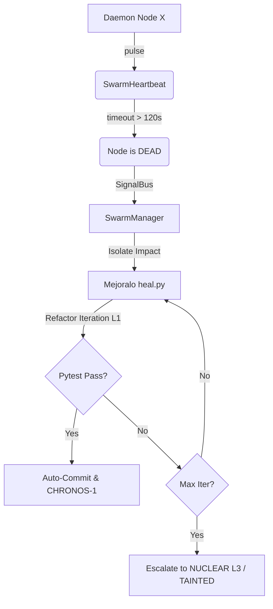

# CORTEX Swarm Resilience (Hito 2: Auto-Heal & Heartbeat)

> "Intelligence without thermodynamics is friction-free logic. True intelligence operates under cost, time, loss, and irreversibility."
> — CORTEX Axiom Ω₁₃

La Resiliencia en el Enjambre CORTEX no se basa en el manejo de excepciones (`try/except`) o en reintentos probabilísticos simples. Se fundamenta en una topología de **Curación Bizantina** y **Monitorización de Latido Termodinámico**.

El sistema asume que los hilos asíncronos y los procesos aislados eventualmente colapsarán (Singularidad / Muerte Silenciosa), ya sea por errores de memoria, bucles infinitos en ejecución estocástica, o colapsos de los modelos fundacionales.

---

## 1. El Latido del Enjambre (`swarm_heartbeat.py`)

La topología principal de detección de fallos vitales es el `SwarmHeartbeat`. Opera bajo la métrica estructural de O(1), desligado del wall-clock (NTP) empleando tiempos monotónicos para la verificación vital de los Daemons.

### Mecánica de Pulso (Proof of Life)
1.  **Emisión de Pulso**: Cada daemon o worker asíncrono debe emitir un `.pulse()` de forma regular dentro de su ciclo de ejecución.
2.  **Transición de Estado**: Si un worker no pulsa dentro del ciclo designado, el orquestador lo marca como `SUSPECT`. Si la carencia de pulso excede su threshold, transiciona a `DEAD`.
3.  **Circuit Breaker Asíncrono**: Al cambiar a `DEAD`, el Swarm emite una señal a través del `SignalBus` (`node:dead`). Esto alerta al `SwarmManager` de que un componente vital ha perdido reloj (ej. `NightShiftCrystalDaemon` se ha bloqueado).

---

## 2. Autocuración Implacable (Relentless Healing) (`heal.py`)

CORTEX no "reinicia" el módulo o ignora la falla. Resuelve la entropía generada. Cuando una anomalía, regresión en test o muerte funcional ocurre, MEJORAlo y el `SwarmManager` delegan el rediseño usando `heal.py`.

### Arquitectura de Curación 
1.  **Detección Dimensional**: Se mapean las regresiones hacia archivos específicos (Topological Sort para aislar dependencias/hojas).
2.  **Circuit Breaker Escalonado**:
    *   **Level 1 (NORMAL)**: Curación de bugs estándar.
    *   **Level 2 (AGRESIVO)**: Refactorización estructural forzada si el archivo no supera la integridad test-driven (Pytest).
    *   **Level 3 (NUCLEAR / Tainted Circuit Breaker)**: Si el código resiste a las iteraciones, es declarado `TAINTED`. Queda bloqueado cognitivamente para la Inteligencia Estándar y escala exclusivamente hacia especialistas topológicos (ej. `Ariadne-Arch-Omega`).
3.  **Compound Yield (CHRONOS-1)**: Si el proceso de `heal.py` soluciona la regresión sin degradar el `score` de complejidad estricta (130/100 Ruff Aesthetics, Pytest), extrae las horas salvadas matemáticas y autocomitea el arreglo al repositorio como `[MEJORAlo Auto-Heal]`.

---

## 3. Entropía y Convergencia de Resiliencia

El `SwarmManager` ata estos dos puentes físicos:
Un nodo no solo falla porque lanza una excepción de Python. Un nodo falla termodinámicamente si consume CPU (pulse emitiéndose) pero su trabajo util (Exergy) disminuye (detectado por `trend.py`). Cuando esto sucede, también entra el circuito de Autocuración para refactorizar la lógica muerta.
