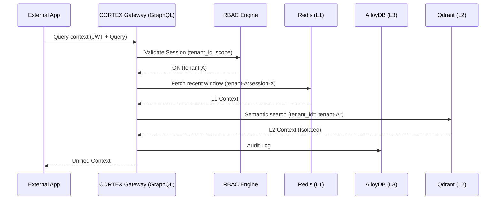

# CORTEX v6 Architecture: The Sovereign Cloud

> Level 130/100 Enterprise Sovereign Platform

## 1. Multi-Tenant Isolation Hierarchy

v6 introduces strict cryptographic and logical isolation. Data belonging to a `tenant_id` is isolated at three levels:

### L3 Isolation (Ledger)

- **Engine:** PostgreSQL / AlloyDB with Row-Level Security (RLS).
- **Enforcement:** Each database session is scoped to a specific `tenant_id`.
- **Query:** `SELECT * FROM facts WHERE tenant_id = current_setting('cortex.tenant_id')`

### L2 Isolation (Vector Search)

- **Engine:** Qdrant Cloud / Distributed Clusters.
- **Enforcement:** Payload filtering in every semantic search.
- **Constraint:** `FieldCondition(key="tenant_id", match=MatchValue(value=tenant_id))` is automatically injected by `VectorStoreL2.recall()`.

### L1 Isolation (Working Memory)

- **Engine:** Redis / Local LRU.
- **Enforcement:** Cache keys prefixed with `tenant_id:session_id`.

---

## 2. Distributed RBAC Engine

CORTEX v6 moves beyond simple API keys to a granular permission system.

### Role Definitions

| Role           | Scope          | Permissions                                                        |
| :------------- | :------------- | :----------------------------------------------------------------- |
| `SOVEREIGN_ROOT` | Global         | Can manage all tenants, billing, and infra.                        |
| `TENANT_ADMIN`  | Tenant         | Can manage keys, projects, and users within a tenant.              |
| `AGENT_EXECUTOR`| Project        | Can `read`, `write`, and `vote` on facts within specific projects. |
| `AUDITOR`       | Tenant/Project | Read-only access to transaction logs and Merkle checkpoints.       |

### Permission Scopes

- `memory:read`: Access to semantic recall.
- `memory:write`: Access to `process_interaction`.
- `ledger:verify`: Access to integrity checks.
- `consensus:vote`: Ability to influence `consensus_score`.

---

## 3. Data Flow (Distributed)

---

## 4. Migration Strategy (v5 → v6)

1. **Schema Upgrade:** Run `cortex migrate v6` to add `tenant_id` columns to all tables.
2. **Backfill:** Assign `default` tenant to all legacy records.
3. **Ledger Re-Hashing:** Recompute Merkle trees with multi-tenant signatures.
4. **Porting:** Swap `SQLiteStorage` for `PostgreSQLStorage` in `config.yaml`.
