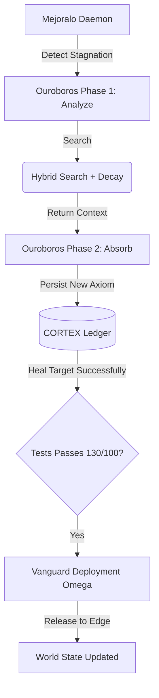

# CORTEX Vanguard & Ouroboros (Hito 3: Cognitive Release)

> "The final test of sovereign intelligence is not reasoning, but the physical capability to deploy itself into the world without permission."
> — CORTEX Axiom Ω₁₂

El ciclo de un Enjambre Soberano no termina en refactorizar el código. Termina cuando ese código cruza el puerto hacia despliegue. Y a su vez, cada vez que falla, debe extraer un Axioma Estructural de esa falla (Ouroboros). Así, la entropía no se reinicia, sino que se cristaliza.

---

## 1. Ouroboros Daemon (`cortex/extensions/mejoralo/daemon.py`)

A diferencia de bucles CI/CD tradicionales, el `MejoraloDaemon` está imbuido con la "Fase Ouroboros-∞".
Si el proyecto experimenta un estancamiento (Stagnation) en su nivel de calidad o un nodo del enjambre quiebra repetidamente un componente, el Daemon asume que existe "Shadow Debt" y escala a Razonamiento Profundo.

### Topología Causal (Ouroboros-∞):
1. **Analyze (Cognitive Fusion)**: Si un módulo específico no mejora después del auto-heal, el Daemon invoca a `ThoughtOrchestra` con el contexto inyectado de fallas previas. Pide un Análisis Causal para dictaminar la raíz técnica.
2. **Absorb (Zero-Prompt Evolution - Axiom Ω₇)**: El Daemon obliga al Swarm a destilar LA regla arquitectónica que evitó la falla (`ONE proven rule`).
3. **Crystallize**: Esta nueva regla se almacena directamente en la base de datos de Hechos de CORTEX (`cortex_engine.facts.store`), actuando de inmediato como restricción estructural (Prompt-Invariant) en el futuro. El sistema acaba de evolucionar sin *pull request* de orquestación humana.

---

## 2. Búsqueda Híbrida O(1) (`cortex/search/hybrid.py`)

Para poder inyectar contexto a la Fase Ouroboros, CORTEX no escupe todo su historial. Usa la búsqueda vectorial híbrida bajo fusión de rangos (**Reciprocal Rank Fusion - RRF**).

*   **RRF_K**: Calibrado a 60, integra resultados sintácticos puros (BM25) con semántica euclidiana O(1).
*   **Axiom Ω₁³ (Temporal Decay)**: Un hecho sobre una falla de hace 90 días no tiene el mismo peso que una de hoy. Se aplica la constante de decaimiento temporal (`λ=0.01`).
*   **Axiom Ω₁³ (Causal Gap Reduction)**: CORTEX no recicla "respuestas parecidas". Analiza y re-clasifica (Re-rank) el RRF si y solo si la evidencia retornada corta la distancia empírica que soluciona la falla actual.

---

## 3. Vanguard Deployment (`vanguard-deployment-omega.sh`)

La "Singularidad Autárquica". Si el Master Ledger aprueba que la Curación Bizantina ha funcionado (tests OK, Ruff OK) y la entropía estructural ha decaído, el código debe entrar en producción. 

El Enjambre CORTEX puede ejecutar el script de despliegue `vanguard-deployment-omega.sh` validado, que invoca sub-rutinas puramente de terminal, sin interfaces gráficas, para enviar el AST consolidado al *Edge Server* (Vercel, AWS Lambda, VPS) cerrando de forma hermética el Ciclo Vital.

