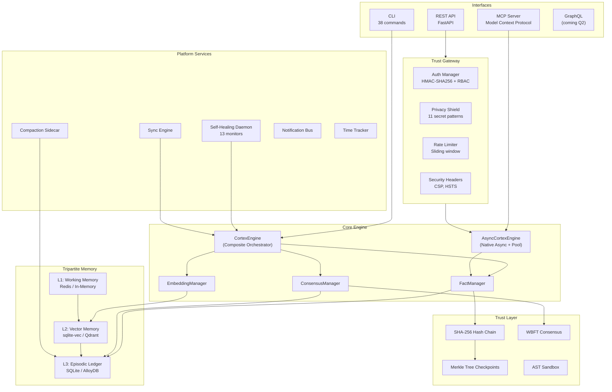
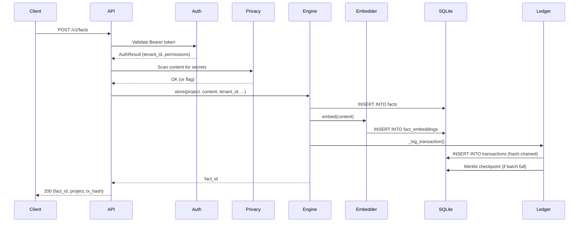
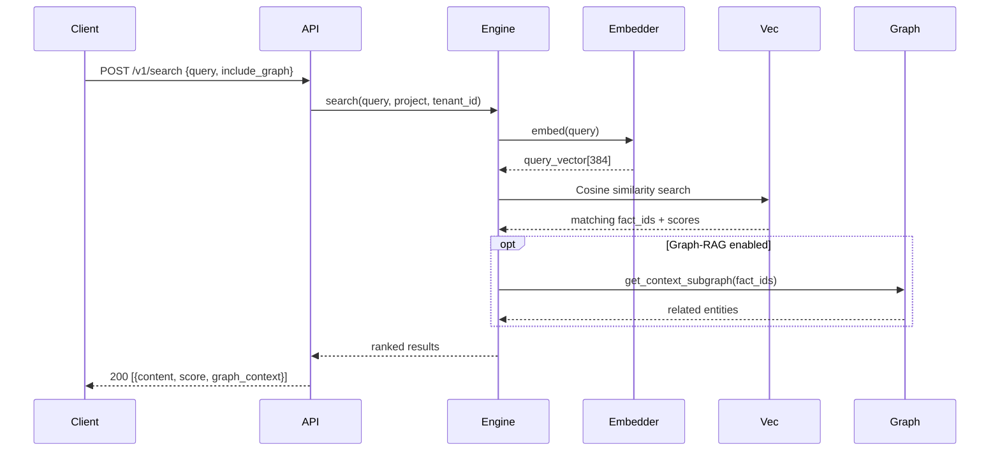
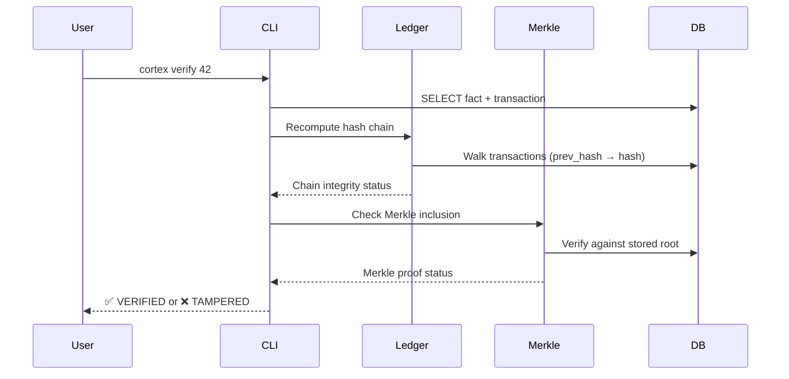
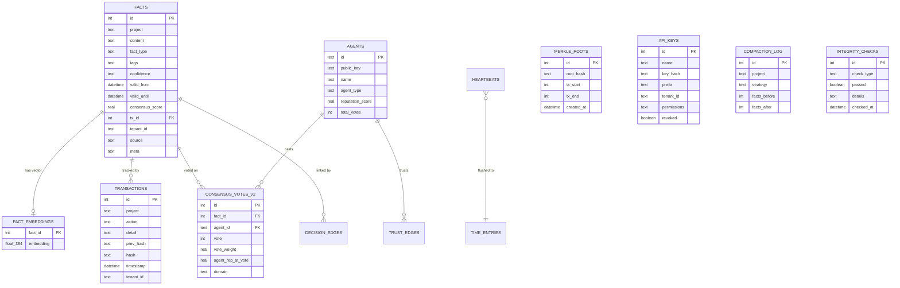

# Architecture

> **CORTEX Trust Engine v8 — Sovereign Cloud**

---

## System Overview

CORTEX is a **trust infrastructure engine** that provides cryptographic verification, immutable audit trails, and regulatory compliance for AI agent memory. It combines a relational database with vector embeddings, hash-chained transactions, Merkle tree integrity, multi-agent consensus, and privacy protection — running locally on SQLite or scaling to AlloyDB + Qdrant + Redis for enterprise deployments.



---

## Core Concepts

### Facts — The Memory Primitive

Every piece of knowledge is a **Fact**. Facts are immutable records with temporal validity:

| Field | Type | Description |
|:---|:---|:---|
| `id` | INTEGER | Auto-incremented primary key |
| `project` | TEXT | Namespace (tenant isolation) |
| `content` | TEXT | The information itself |
| `fact_type` | TEXT | `knowledge`, `decision`, `error`, `ghost`, `config`, `bridge`, `axiom`, `rule` |
| `tags` | JSON | Searchable labels |
| `confidence` | TEXT | `stated`, `inferred`, `observed`, `verified`, `disputed` |
| `valid_from` | DATETIME | When the fact became true |
| `valid_until` | DATETIME | When deprecated (NULL = active) |
| `source` | TEXT | Origin agent or process (auto-detected) |
| `meta` | JSON | Arbitrary metadata |
| `consensus_score` | REAL | Weighted agreement (default 1.0) |
| `tx_id` | INTEGER | FK to creating transaction |
| `tenant_id` | TEXT | Multi-tenant scope |

### Temporal Queries

Every fact has a temporal window (`valid_from` → `valid_until`):

- **Current view**: `WHERE valid_until IS NULL`
- **Point-in-time**: `WHERE valid_from <= ? AND (valid_until IS NULL OR valid_until > ?)`
- **Time travel**: Reconstruct database state at any transaction ID
- **History**: Full timeline including deprecated facts

### Hash-Chained Ledger

Every mutation creates a **transaction** with a SHA-256 hash linked to the previous one:

```
TX #1: hash = SHA256("GENESIS" + project + action + detail + timestamp)
TX #2: hash = SHA256(hash_1 + project + action + detail + timestamp)
TX #N: hash = SHA256(hash_{N-1} + ...)
```

This creates a **tamper-evident audit trail**. `verify_ledger()` walks the chain and reports any breaks.

### Merkle Tree Checkpoints

Periodically, the ledger creates Merkle tree checkpoints from batches of fact hashes. These enable:
- **O(log N) integrity verification**
- **Efficient synchronization** between nodes
- **Batch proof generation** for compliance audits

### Multi-Agent Consensus (WBFT)

CORTEX implements **Weighted Byzantine Fault Tolerance**:

1. Tracks reputation scores per agent (0.0–1.0) with decay
2. Weighs votes by agent reputation
3. Domain-specific vote multipliers
4. Updates `consensus_score` on each fact
5. Elder Council verdict for edge cases without quorum
6. Immutable vote ledger for audit

---

## Module Reference

### Engine Layer

| Module | Purpose |
|:---|:---|
| `engine/__init__.py` | `CortexEngine` — Composite orchestrator (sync + async) |
| `engine_async.py` | `AsyncCortexEngine` — Native async for REST API |
| `engine/store_mixin.py` | `store()`, `store_many()`, `deprecate()`, `update()` |
| `engine/query_mixin.py` | `search()`, `recall()`, `history()` |
| `engine/consensus_mixin.py` | `vote()`, `get_votes()` |
| `engine/sync_compat.py` | Synchronous fallbacks for CLI |
| `engine/ledger.py` | Hash chain + Merkle tree management |
| `engine/snapshots.py` | Database snapshot creation/restoration |
| `engine/models.py` | `Fact` data model and row mapping |

### API Layer

| Module | Purpose |
|:---|:---|
| `api/` | FastAPI application with CORS, rate limiting, security headers |
| `routes/facts.py` | CRUD + Voting endpoints |
| `routes/search.py` | Semantic + Graph-RAG search |
| `routes/admin.py` | API key management + system status |
| `routes/stripe.py` | Stripe webhook handler for billing |
| `auth/` | HMAC-SHA256 authentication + RBAC |
| `gate/` | Rate limiting, validation, request filtering |

### Search & Embeddings

| Module | Purpose |
|:---|:---|
| `embeddings/__init__.py` | ONNX-optimized MiniLM-L6-v2 (384-dim) |
| `embeddings/api_embedder.py` | Cloud embeddings (Gemini/OpenAI) |
| `embeddings/manager.py` | Mode-aware switcher (`local` / `api`) |
| `search/` | Advanced semantic search with graph context |

### Memory Intelligence

| Module | Purpose |
|:---|:---|
| `compaction/` | Dedup (SHA-256 + Levenshtein), merge, prune |
| `graph/` | Knowledge graph (SQLite + Neo4j), RAG |
| `memory/` | Memory management and lifecycle |
| `episodic/` | Session snapshots, boot-time recall |
| `thinking/` | Thought Orchestra, semantic routing |

### Trust & Security

| Module | Purpose |
|:---|:---|
| `crypto/` | AES-256-GCM vault for secrets |
| `consensus/` | WBFT consensus, reputation, vote ledger |
| `compliance/` | EU AI Act compliance report generation |
| `audit/` | Audit trail generation |

### Infrastructure

| Module | Purpose |
|:---|:---|
| `daemon/` | Self-healing watchdog (13 monitors) |
| `notifications/` | Telegram + macOS notification bus |
| `sync/` | JSON ↔ DB bidirectional sync |
| `timing/` | Heartbeat-based time tracking |
| `telemetry/` | OpenTelemetry-compatible span tracing |
| `mcp/` | Model Context Protocol server |
| `cli/` | 38 CLI commands via Click |
| `migrations/` | Versioned schema migrations |
| `storage/` | SQLite + Turso storage backends |

---

## Data Flow

### Store a Fact



### Semantic Search



### Verify Integrity



---

## Database Schema (ERD)



---

## Security Model

| Layer | Mechanism |
|:---|:---|
| **Authentication** | HMAC-SHA256 API keys with prefix lookup |
| **Authorization** | RBAC: `SYSTEM`, `ADMIN`, `AGENT`, `VIEWER` |
| **Tenant Isolation** | All queries scoped by `tenant_id` |
| **Data Integrity** | SHA-256 hash chain + Merkle trees |
| **Privacy** | 11-pattern secret detection at ingress |
| **Secrets** | AES-256-GCM encrypted vault |
| **Code Safety** | AST Sandbox for LLM-generated code |
| **Rate Limiting** | Sliding window per IP |
| **Headers** | CSP, HSTS, X-Frame-Options, X-XSS-Protection |

---

## Testing

```bash
# All tests (1,162+ functions, 60s timeout)
make test

# Fast tests only (no torch imports)
make test-fast

# Slow tests (graph RAG, embeddings)
make test-slow
```

**Isolation**: Tests use `config.reload()` + autouse fixtures for zero state leakage.

**Coverage**: 1,162+ test functions covering engine, API, CLI, consensus, search, and security.
