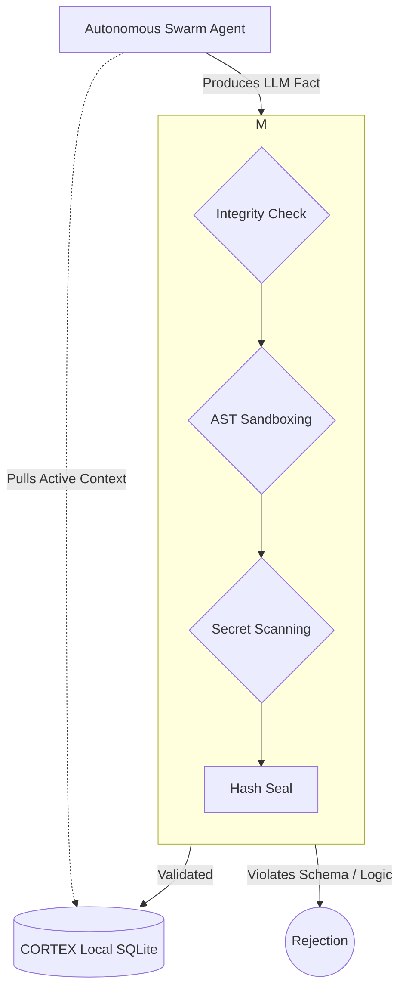

# CORTEX Architecture Overview

## Product Boundary

The default product boundary for CORTEX Persist is narrower than the full repository.

The stable surface is the **local-first verifiable memory core**:

- fact storage and retrieval
- semantic search
- tamper-evident ledger verification
- trust/compliance reporting
- health and admin status

Broader swarm, dashboard, realtime, and orchestration systems still exist in the codebase, but they should be treated as secondary or experimental layers unless they are explicitly enabled for a deployment.

### Components

1.  **The Memory (Lizard Brain)**
    -   **SQLite (`cortex.db`)**: The physical storage of facts.
    -   **Vector Store (`chromadb`)**: Semantic search and retrieval.
    -   **Graph (`networkx`)**: Relationships between entities (Code <-> Doc <-> Person).

2.  **The Engine (Prefrontal Cortex)**
    -   **`CortexEngine`**: The main interface. Handles ingestion, retrieval, and synthesis.
    -   **`ledger.py`**: Merkle-backed immutable log of all thoughts/actions.
    -   **`sovereign_gate.py`**: The firewall. Decides what enters long-term memory.

3.  **The Swarm (Nervous System, optional/experimental)**
    -   **`dispatch.py`**: Routes tasks to specialized agents.
    -   **`adapter.py`**: Connects to external MCP tools (Git, Terminal, Browser).

## Data Flow & Truthing Membrane

The core of CORTEX is the Verification Membrane. Agents cannot write arbitrary data directly to the ledger. Every mutation is intercepted, validated, securely sanded, and sealed. 

1.  **Ingestion**: `Agent Thought` -> `Verification Membrane` -> `Hash Chain Seal` -> `Storage`.
2.  **Recall**: `Query` -> `Semantic Search` + `Merkle Integrity Check` -> `Context Assembly`.
3.  **Action**: `Plan` -> `CORTEX Receipt Export` -> `Execute with Evidence`.

## Evolution Layers

For later waves, CORTEX can expand from trust infrastructure toward a broader cognitive/orchestration system. That expansion should remain opt-in and should not blur the default product contract unless the deployment explicitly requires it.

---
**Sovereign Architecture · Industrial Noir · v8.0.0 Alpha**
