# Arquitecturas de Soberanía Cognitiva

**Optimización, Persistencia y Verificabilidad en Agentes de IA de Próxima Generación**

> [!NOTE]
> Este documento establece el marco teórico-práctico que sustenta la arquitectura de [CORTEX](file:///Users/borjafernandezangulo/cortex) y el [Enjambre Centauro](file:///Users/borjafernandezangulo/game/moskv-swarm). Cada sección mapea directamente a componentes implementados o en roadmap.

---

## Introducción: El Imperativo de la Evolución Arquitectónica

La trayectoria actual de la Inteligencia Artificial generativa ha alcanzado un punto de inflexión crítico. Los sistemas de primera generación, caracterizados por interacciones apátridas y recuperaciones de información simplistas, se enfrentan a un **"techo de inteligencia"** que limita su aplicabilidad en entornos empresariales y críticos.

La pregunta fundamental de *"cómo mejorarlo"* no se responde simplemente incrementando el tamaño de los parámetros de los modelos, sino mediante una **reingeniería profunda de la arquitectura subyacente** que soporta la cognición sintética.

Para transformar asistentes reactivos en **agentes soberanos** capaces de razonamiento estratégico y ejecución autónoma, es necesario abordar cuatro pilares de optimización:

1. La **eficiencia en la recuperación de datos** a hiperescala
2. La **estructuración de la memoria** a largo plazo
3. La implementación de **bucles de razonamiento metacognitivo**
4. La instauración de **garantías de seguridad criptográfica**

El estado actual del arte, dominado por la Generación Aumentada por Recuperación (RAG) convencional, sufre de *amnesia contextual* y *latencia operativa*. Los agentes carecen de una comprensión persistente del mundo y operan bajo un paradigma de confianza ciega que es inaceptable para sectores regulados.

La mejora sustancial de estos sistemas requiere la transición hacia **arquitecturas de memoria unificada** que integren vectores, gráficos de conocimiento y series temporales, respaldadas por mecanismos de consenso bizantino y pruebas de conocimiento cero. Este informe detalla la hoja de ruta técnica para elevar la IA desde la automatización de tareas (Nivel 2) hacia la **colaboración estratégica autónoma (Nivel 4)**, estableciendo nuevos estándares en rendimiento computacional y soberanía de datos.

---

## 1. El Sustrato de la Velocidad: Optimización Vectorial y Cuantización en el Borde

La capacidad de un agente para recuperar información relevante en tiempo real es el cuello de botella primario en la experiencia de usuario y la eficacia operativa. Las implementaciones iniciales, que dependen de búsquedas vectoriales de fuerza bruta, se vuelven insostenibles a medida que los corpus de conocimiento escalan hacia los miles de millones de vectores.

### 1.1 De la Búsqueda Lineal a la Navegación Jerárquica (HNSW)

En los sistemas de recuperación básicos, la identificación de los vecinos más cercanos (K-Nearest Neighbors, KNN) se realiza mediante un escaneo exhaustivo que calcula la distancia — ya sea Euclidiana o de Coseno — entre el vector de consulta y cada uno de los vectores almacenados en la base de datos.

Este enfoque presenta una complejidad computacional de **O(N · D)**, donde *N* representa el número total de vectores y *D* la dimensionalidad del embedding. Cuando se opera con modelos modernos como `text-embedding-3-small` de OpenAI (1536 dimensiones) sobre un conjunto de un millón de registros, el sistema debe ejecutar miles de millones de operaciones de punto flotante por cada consulta individual, resultando en latencias inaceptables para aplicaciones interactivas.

La solución reside en la implementación de índices de **Mundo Pequeño Jerárquico Navegable (HNSW)**:

```mermaid
graph TB
    subgraph "Capa 3 — Autopista Global"
        A((N1)) -.-> B((N47))
        B -.-> C((N215))
    end
    subgraph "Capa 2 — Conexiones Intermedias"
        D((N1)) --> E((N12)) --> F((N28))
        F --> G((N47))
    end
    subgraph "Capa 1 — Red Densa Local"
        H((N1)) --> I((N3)) --> J((N5))
        J --> K((N8)) --> L((N12))
    end
    A --> D
    D --> H
    B --> G
    G --> L
    style A fill:#1a1a2e,stroke:#e94560
    style B fill:#1a1a2e,stroke:#e94560
    style C fill:#1a1a2e,stroke:#e94560
```



HNSW reestructura el espacio vectorial como un grafo multicapa. En las capas superiores, los nodos están conectados de manera escasa, permitiendo "saltos" largos a través del espacio semántico. A medida que la búsqueda desciende a capas inferiores, la densidad aumenta, permitiendo refinamiento local. Esto transforma la complejidad a **O(log N)**.

> [!IMPORTANT]
> **Mapeo a CORTEX:** El módulo `sqlite-vec` integrado en CORTEX utiliza HNSW como índice primario para la tabla `vec_facts`. La configuración actual contempla `M=16` conexiones por nodo y `efConstruction=200` para balancear recall vs. velocidad de indexación.

### 1.2 Cuantización Binaria: Compresión Radical y Aceleración por Hardware

La **Cuantización Binaria (BQ)** comprime cada dimensión del vector a un solo bit: los valores positivos se convierten en `1` y los negativos o cero en `0`.

| Métrica | float32 | Binario | Factor |
|---------|---------|---------|--------|
| Almacenamiento por vector (384d) | 1,536 bytes | 48 bytes | **32×** |
| Índice 1M vectores | ~1.5 GB | ~48 MB | **32×** |
| Operación de similitud | Producto punto FP | XOR + `popcount` | **15-45× más rápido** |
| Recall@10 | 100% | ~92-95% | Marginal |

Al operar con vectores binarios, el cálculo de similitud utiliza la **Distancia de Hamming** — operaciones lógicas XOR seguidas de conteo de bits activados (`popcount`), instrucciones optimizadas a nivel de hardware en CPUs modernas (AVX-512 en x86, NEON en ARM).

> [!TIP]
> **Estrategia de re-puntuación (rescoring):** Usar el índice binario para recuperar un conjunto candidato amplio (top-100 ANN) y aplicar los vectores originales float32 solo a estos candidatos para el ranking final. Velocidad binaria + precisión float32.

### 1.3 Arquitecturas de Almacenamiento: Shadow Tables y DiskANN

La integración de capacidades vectoriales en bases de datos relacionales utiliza **tablas sombra (shadow tables)**. Las implementaciones como `sqlite-vec` serializan los nodos del grafo HNSW directamente en tablas internas del motor de base de datos, asegurando que las operaciones vectoriales cumplan las propiedades **ACID**.

Para escenarios hiperescala donde el índice excede la RAM — situación común en agentes soberanos sobre hardware modesto — la arquitectura óptima es **DiskANN**:

- Diseñado para aprovechar SSDs modernos
- Optimiza el grafo para minimizar lecturas aleatorias de disco
- Sirve consultas con índices **10× mayores que la RAM del sistema**
- Rompe la dependencia de hardware costoso

> [!IMPORTANT]
> **Mapeo a CORTEX:** El `EmbeddingPrunerMixin` implementado en `cortex/engine/embeddings.py` gestiona la compresión adaptativa. Cuando se alcanza el umbral de embeddings (`CORTEX_MAX_EMBEDDINGS`), el pruner aplica cuantización escalar y eliminación de vectores de baja utilidad.

---

## 2. Ingeniería de Contexto y Memoria Persistente: Más Allá del RAG Estático

La mejora cualitativa trasciende la velocidad de recuperación — reside en la **calidad y estructuración del contexto**. El paradigma RAG tradicional muestra deficiencias críticas en razonamiento global, comprensión de relaciones indirectas y memoria a largo plazo.

### 2.1 GraphRAG y la Dimensión Temporal

El RAG estándar opera bajo una limitación estructural: recupera "puntos" de datos aislados sin comprender la topología que los une.

**GraphRAG** aborda esta deficiencia mediante:

1. **Extracción de entidades y relaciones** del texto crudo usando LLMs
2. **Detección de comunidades** (algoritmo de Leiden) para identificar clústeres temáticos
3. **Resúmenes jerárquicos pre-computados** para consultas de alto nivel
4. **Aristas temporales** (framework Graphiti) que distinguen hechos vigentes vs. obsoletos


> [!IMPORTANT]
> **Mapeo a CORTEX:** El módulo `cortex/engine/graph/` implementa un grafo de conocimiento con aristas temporales via `valid_from`/`valid_until` en cada fact. El `QueryMixin.search()` combina búsqueda vectorial + filtrado temporal via `as_of`.

### 2.2 Arquitectura Unificada de Memoria: El Modelo PostgreSQL

La fragmentación de la infraestructura introduce latencia y complejidad que obstaculizan la autonomía del agente. La arquitectura de referencia unifica **tres tipos de memoria cognitiva**:

| Tipo de Memoria | Función Cognitiva | Implementación en CORTEX |
|-----------------|-------------------|--------------------------|
| **Episódica** | Registro autobiográfico secuencial (*"¿Qué tarea realizamos ayer?"*) | Tabla `facts` con `created_at` como series temporales. Consultas de rango temporal via `time_travel()` |
| **Semántica** | Conocimiento cristalizado y hechos recuperables | `vec_facts` con embeddings `all-MiniLM-L6-v2` (384d) + HNSW index |
| **Procedimental** | Habilidades, preferencias, reglas de negocio | Tabla `facts` con `fact_type='procedure'` + `confidence='verified'` |

Esta unificación permite consultas cognitivas complejas en una sola transacción SQL:

```sql
-- Ejemplo: Recuperar las 5 últimas interacciones sobre "seguridad" con confianza verificada
SELECT f.content, f.created_at, f.confidence
FROM facts f
JOIN vec_facts v ON v.fact_id = f.id
WHERE f.project = 'moskv-swarm'
  AND f.created_at > datetime('now', '-7 days')   -- Memoria episódica
  AND f.confidence = 'verified'                     -- Memoria procedimental
ORDER BY vec_distance_cosine(v.embedding, ?)        -- Memoria semántica
LIMIT 5;
```

> [!IMPORTANT]
> **Mapeo a CORTEX:** El pipeline verificado en el smoke test (`smoke_test_cortex_pipeline.py`) demostró la unificación: `post_fact` (semántica), `persist_mission_insight` (procedimental) y `get_summary` (episódica) operan sobre la misma base SQLite con integridad ACID.

### 2.3 Búsqueda Híbrida y Fusión de Rangos (RRF)

Los modelos de embedding sobresalen en matices semánticos (*"vehículo" ↔ "coche"*) pero fallan en coincidencia exacta de palabras clave, códigos o nombres propios.

La **Fusión de Rango Recíproco (RRF)** sintetiza búsqueda vectorial + léxica (BM25):

```
RRF_score(d) = Σ 1 / (k + rank_i(d))
```

Donde `k` es una constante de suavizado (típicamente 60) y `rank_i(d)` es la posición del documento `d` en la lista de resultados del método `i`.

> [!IMPORTANT]
> **Mapeo a CORTEX:** El `SearchMixin` en `cortex/engine/search.py` implementa búsqueda híbrida combinando `sqlite-vec` (vectorial) + FTS5 (léxica) con RRF. El `recall_context()` del bridge actual usa fallback de texto (LIKE queries) cuando `sqlite-vec` no está disponible.

---

## 3. Modelos de Mundo y Razonamiento Estratégico: El Sistema 2 de la IA

Una vez resueltos los desafíos de almacenamiento y memoria, la mejora cualitativa del agente depende de su capacidad de razonamiento. Los agentes actuales operan en modo reactivo (Sistema 1). Para tareas complejas, es imperativo implementar el **Sistema 2**: deliberativo, planificador y autocrítico.

### 3.1 Arquitectura AERO y el Doble Bucle de Aprendizaje

El framework **AERO** (Autonomous Evolutionary Reasoning Optimization) implementa un sistema de doble bucle endógeno:

```mermaid
graph TD
    subgraph "Bucle Interno — Fábrica de Datos"
        G["🎯 Generador<br/>(Self-Questioning)"] --> S["🔧 Solucionador<br/>(Self-Answering)"]
        S --> C["🔍 Crítico<br/>(Self-Criticism)"]
        C -->|"Rechaza"| G
        C -->|"Aprueba"| V["✅ Experiencia Validada"]
    end
    subgraph "Bucle Externo — Consolidación"
        V --> F["Fine-tuning / Prompt Optimization"]
        F --> M["Memoria Procedimental Mejorada"]
        M -.->|"ZDP calibrada"| G
    end
    style G fill:#1a1a2e,stroke:#e94560
    style C fill:#1a1a2e,stroke:#ffd700
    style V fill:#1a1a2e,stroke:#16c79a
```



**Zona de Desarrollo Próximo (ZDP):** Los desafíos se calibran para estar ligeramente por encima de la competencia actual confirmada del agente — evitando estancamiento (tareas triviales) y colapso del aprendizaje (tareas imposibles).

**Corrección Contrafactual Independiente (ICC):** El agente verifica conclusiones asumiendo inicialmente que su respuesta es **incorrecta** e intenta construir un camino lógico que justifique el error. Si no lo logra → confianza reforzada. Si lo logra → reevaluación profunda.

> [!IMPORTANT]
> **Mapeo a Centauro:** El `ConsensusBreaker` en `moskv-swarm/consensus/` implementa una versión práctica del ICC — cuando los agentes del enjambre no alcanzan consenso, se escala a un `ElderCouncil` (3 evaluadores independientes) o a `HumanEscalation` via el `SovereignGate`.

### 3.2 Modelos de Mundo para Planificación Estratégica

La **simulación mental** permite al agente proyectar consecuencias antes de ejecutar:

- Antes de `delete_file` → simular ruptura de dependencias
- Antes de `deploy_production` → simular impacto en servicios dependientes
- Antes de `execute_trade` → simular impacto en portfolio bajo varios escenarios

> [!IMPORTANT]
> **Mapeo a CORTEX:** El `SovereignGate` (`cortex/sovereign_gate.py`) implementa la barrera de planificación deliberada — las acciones L3 (destructivas) requieren aprobación explícita del operador, impidiendo ejecución reactiva del Sistema 1.

---

## 4. Gobernanza, Seguridad y Verificabilidad: La Capa de Confianza

A medida que los agentes escalan hacia Nivel 4/5 de autonomía, la seguridad basada en "guardarraíles de texto" es insuficiente. La mejora exige **garantías criptográficas verificables y arquitecturas de confianza cero**.

### 4.1 Soberanía de Hardware: TEEs y Computación Confidencial

Los **Entornos de Ejecución Confiables (TEEs)** — Intel TDX, AMD SEV, NVIDIA Confidential Computing — proporcionan:

- **Encriptación en uso:** Pesos del modelo y datos del usuario permanecen encriptados en RAM durante toda la inferencia
- **Atestación remota:** El agente puede probar criptográficamente que ejecuta una versión no adulterada de su código y modelo

> [!CAUTION]
> Indispensable para el despliegue en finanzas y salud, donde la integridad del algoritmo es tan crítica como la confidencialidad de los datos.

### 4.2 Auditoría Inmutable: ZK-Proofs y ZKSQL

Las **Pruebas de Conocimiento Cero (ZK-Proofs)** resuelven la "Paradoja de la Auditoría":

```
ZK-Audit Log = Proof(
    input ∈ Domain,
    model = certified_version,
    filters = [safety_check_1, ..., safety_check_N] ALL PASSED,
    output = f(input, model, filters)
) → VERIFIABLE sin revelar input ni output
```

**ZKSQL** extiende esto a consultas analíticas — un regulador puede lanzar queries SQL sobre la base de datos privada y recibir respuestas con prueba criptográfica de corrección y completitud, sin acceso de lectura a registros individuales.

> [!IMPORTANT]
> **Mapeo a CORTEX:** El `LedgerMixin` (`cortex/engine/ledger.py`) implementa un log de auditoría inmutable con hashes canónicos SHA-256 encadenados (cada entrada referencia el hash de la anterior). El `time_travel()` permite reconstrucción forense del estado en cualquier punto temporal.

### 4.3 Consenso en Enjambres Multi-Agente

La integridad del enjambre se mejora mediante protocolos de consenso **ponderados por reputación**:

```python
# Modelo de reputación con castigo exponencial
T_i(t+1) = T_i(t) + α·success - β·exp(γ·failures)

# Selección de líder via VRF ponderada
P(agent_i = leader) = T_i / Σ T_j  ∀j ∈ swarm
```

| Evento | Impacto en Reputación |
|--------|----------------------|
| Contribución precisa y oportuna | +α (lineal) |
| Timeout | -β·e^γ (exponencial) |
| Resultado validado como erróneo | -β·e^(2γ) (exponencial agresivo) |
| Comportamiento bizantino detectado | Reset a T_min → exclusión práctica |

> [!IMPORTANT]
> **Mapeo a Centauro:** Los módulos `consensus/reputation.py` (Reputation Economy), `consensus/web_of_trust.py` (Web of Trust) y `consensus/breaker.py` (ConsensusBreaker) implementan el stack completo BR-PBFT con decay temporal y escalación multicapa.

---

## Conclusiones

La mejora de los sistemas de IA para alcanzar niveles de agencia soberana no es un proceso incremental, sino una **transformación arquitectónica**:


| Pilar | Tecnología Clave | Estado en CORTEX |
|-------|-----------------|------------------|
| Velocidad | HNSW + Cuantización Binaria | ✅ `sqlite-vec` + `EmbeddingPrunerMixin` |
| Memoria | Unificada (Episódica + Semántica + Procedimental) | ✅ Smoke test 10/10 verificado |
| Razonamiento | AERO + ICC + Modelos de Mundo | 🔶 `ConsensusBreaker` + `SovereignGate` |
| Confianza | Ledger inmutable + Consenso bizantino | ✅ `LedgerMixin` + `BR-PBFT` |

La convergencia de estas tecnologías define el nuevo estado del arte: **agentes que no solo procesan información a velocidades sobrehumanas, sino que razonan con profundidad estratégica y operan con integridad verificable.**

---

> *Documento generado para el proyecto CORTEX — Febrero 2026*
> *Borja Moskv · Arquitecturas de Soberanía Cognitiva*
