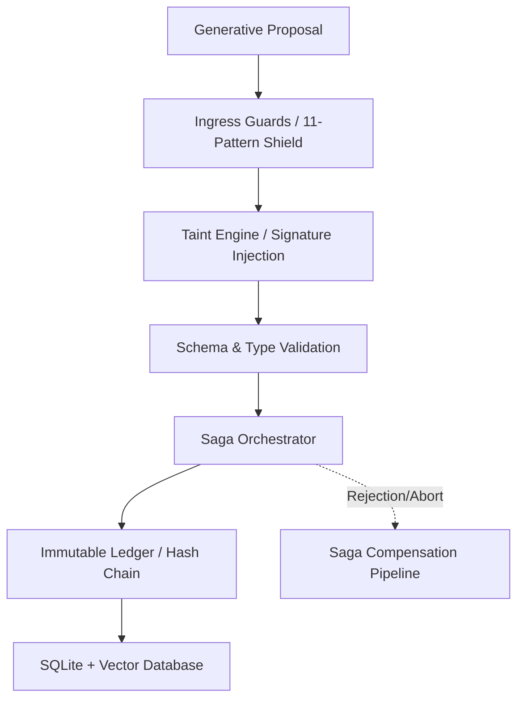

# CORTEX Persist — Manual de Instrucciones y Usuario
**Versión del Sistema:** 0.3.0b3  
**Arquitectura:** Local-First / Híbrida C5-REAL  
**Licencia:** Apache-2.0  

---

## 1. Introducción y Postura Epistémica

CORTEX Persist es un sustrato de persistencia local-first y auditoría forense para sistemas de agentes autónomos de IA. Su diseño parte de una premisa defensiva: **el output generativo es una conjetura probabilística** que debe ser validada deterministamente antes de ser almacenada.

### Principios Fundamentales
*   **Frontera Bizantina:** El código estocástico de LLMs se aísla de la base de datos persistente mediante contratos de validación estrictos.
*   **Evidencia de Manipulación (Tamper-Evidence):** No busca evitar la manipulación física local (imposible en bases de datos integradas como SQLite), sino hacerla criptográficamente evidente mediante cadenas de bloques (hash chains) y checkpoints Merkle.
*   **Cumplimiento del Artículo 12 (EU AI Act):** Automatización del registro forense del ciclo de vida del agente, trazabilidad de fuentes y consistencia temporal para auditorías de alta fiabilidad.

---

## 2. Arquitectura del Sistema

El core de CORTEX está estructurado en capas aisladas para prevenir fugas de entropía y garantizar el principio de localidad de fallos.



### Componentes Críticos
1.  **`cortex/engine/`:** Contiene los motores de almacenamiento, eliminación (`Annihilator`) y solidificación de conocimiento (`Crystallizer`).
2.  **`cortex/ledger.py`:** Administra el ledger inmutable y la integridad de la cadena de hashes SHA-256.
3.  **`cortex/guards/`:** Escudo de admisión que previene la persistencia de credenciales expuestas y datos no sanitizados.
4.  **`cortex/consensus/`:** Motor de Consenso Ponderado por Reputación (RWC) para validaciones multipartitas de agentes.

---

## 3. El Contrato del Write-Path (Patrón Saga)

CORTEX no permite escrituras directas ad-hoc. Toda mutación de estado debe ejecutarse a través de una transacción Saga estructurada de 7 pasos. Si algún paso falla, se ejecuta la compensación en orden inverso.

### Pasos de Ejecución y Compensaciones

| Paso | Acción | Compensación en Aborto |
| :--- | :--- | :--- |
| **SAGA-1** | Admisión y filtrado en Ingress Guards | Registrar rechazo en Ledger. Ninguna escritura. |
| **SAGA-2** | Inyección de firma `CORTEX-TAINT` | Revocar firma de taint del payload. |
| **SAGA-3** | Validación estricta de esquema y tipos | Abortar inmediatamente. |
| **SAGA-4** | Encriptación de datos sensibles | Destruir claves efímeras generadas en memoria. |
| **SAGA-5** | Emisión del evento de auditoría al Ledger | Emitir evento de aborto a la cadena de auditoría. |
| **SAGA-6** | Escritura física en SQLite / Postgres | Ejecutar `ROLLBACK` en base de datos. |
| **SAGA-7** | Indexación vectorial y efectos secundarios | Revertir deltas en índices vectoriales y caché. |

#### Formato Canónico de `CORTEX-TAINT`
```text
taint:{agent_id}:{session_id}:{timestamp_iso8601}:{payload_sha3_256}
```
*Cualquier inserción de datos que carezca de este token es rechazada automáticamente en SAGA-2.*

---

## 4. El Contrato del Read-Path

La lectura de datos impone restricciones de aislamiento estricto para evitar fugas de información inter-inquilino (cross-tenant) y propagación de datos corruptos.

1.  **Aislamiento de Inquilino:** Toda consulta debe incluir `tenant_id`. Las lecturas sin ámbito se bloquean a nivel de motor.
2.  **Propagación de Taint:** Toda consulta que retorne una entidad con taint activo debe propagar el flag a los procesos aguas abajo. Está prohibido remover metadatos de taint en APIs públicas.
3.  **Nivel de Consistencia:** El nivel por defecto es `READ_COMMITTED`. Las lecturas de verificación del ledger (`ledger.py`) exigen aislamiento `SERIALIZABLE`.
4.  **Coherencia de Caché:** Cualquier escritura invalida inmediatamente la caché L1 (`Redis` si está activo) para el `tenant_id` afectado.

---

## 5. Configuración del Entorno

La configuración se inicializa desde variables de entorno a través de `cortex/config.py`.

### Variables Principales

| Variable | Tipo / Defecto | Descripción |
| :--- | :--- | :--- |
| `CORTEX_DB` | `~/.cortex/cortex.db` | Ruta del archivo SQLite principal. |
| `CORTEX_STORAGE` | `local` | Motor: `local` (SQLite), `turso` (Edge), `postgres`. |
| `CORTEX_EMBEDDINGS` | `local` | Modo: `local` (ONNX en CPU) o `api` (remoto). |
| `CORTEX_EMBEDDINGS_PROVIDER`| `gemini` | Proveedor para modo API (`gemini` / `openai`). |
| `GOOGLE_API_KEY` | *(Opcional)* | Key para generación de embeddings API. |
| `CORTEX_API_PORT` | `8484` | Puerto del servidor REST. |
| `CORTEX_ENABLE_EXPERIMENTAL_MCP`| `0` | `1` monta herramientas avanzadas de trazabilidad. |

---

## 6. Interfaz de Línea de Comandos (CLI)

El CLI es un wrapper ligero sobre la capa de servicios. No contiene lógica de negocio.

### Comandos Comunes

#### 1. Inserción de Datos (Store)
```bash
cortex store --content "El agente Alpha validó el bloque 4022" --source "alpha-agent" --tags "audit,blockchain"
```
*Emite una propuesta, ejecuta el Write-Path y retorna el ID de la transacción y de la entidad.*

#### 2. Búsqueda Semántica / Vectorial
```bash
cortex search --query "bloque 4022" --limit 5
```
*Retorna las coincidencias con su correspondiente score de similitud coseno.*

#### 3. Verificación de Integridad del Ledger
```bash
cortex ledger verify
```
*Calcula y verifica la continuidad de hashes SHA-256 de todos los bloques transaccionales. Si hay discontinuidad, lanza código de error 1102.*

#### 4. Generación de Reporte de Cumplimiento (EU AI Act Art. 12)
```bash
cortex compliance-report
```
*Audita la base de datos local y genera el reporte estructural de cumplimiento de retención, trazabilidad y marcas de tiempo.*

---

## 7. Referencia de la API REST

Por defecto corre en `http://localhost:8484`. Toda la API se expone con tipado estricto bajo OpenAPI.

### Endpoints Principales

#### `POST /v1/store`
Escribe una entidad ejecutando la saga completa.
*   **Payload:**
    ```json
    {
      "content": "Validación de telemetría exitosa",
      "source": "sensor-service-01",
      "tenant_id": "tenant-default",
      "metadata": {
        "device": "apple-silicon-m2"
      }
    }
    ```
*   **Respuesta (201 Created):**
    ```json
    {
      "fact_id": "f_01JHG56...",
      "transaction_hash": "a9f4c3...",
      "status": "committed"
    }
    ```

#### `POST /v1/search`
Búsqueda vectorial en el índice local.
*   **Payload:**
    ```json
    {
      "query": "telemetría",
      "limit": 3,
      "tenant_id": "tenant-default"
    }
    ```

#### `GET /v1/ledger/verify`
Inicia un escaneo completo de la consistencia criptográfica en memoria/disco.
*   **Respuesta (200 OK):**
    ```json
    {
      "status": "valid",
      "verified_blocks": 1542,
      "merkle_root": "fa876d2e9c..."
    }
    ```

---

## 8. Integración MCP (Model Context Protocol)

CORTEX Persist se expone como un servidor MCP para entornos de agentes autónomos.

### Configuración en Claude Desktop o Cursor
Añada lo siguiente a su archivo `claude_desktop_config.json`:

```json
{
  "mcpServers": {
    "cortex-persist": {
      "command": "python",
      "args": ["-m", "cortex.mcp"],
      "env": {
        "CORTEX_DB": "/Users/usuario/.cortex/cortex.db",
        "CORTEX_ENABLE_EXPERIMENTAL_MCP": "1"
      }
    }
  }
}
```

### Catálogo de Herramientas Expuertas
*   **`cortex_store`:** Escribe un dato ejecutando las reglas de taint y guards.
*   **`cortex_search`:** Recupera información relevante aplicando filtros por tenant.
*   **`cortex_status`:** Verifica la salud del demonio y del pool de conexiones SQLite.
*   **`cortex_ledger_verify`:** Comprobación forense offline de la base de datos transaccional.

---

## 9. Gobernanza Criptográfica y Gestión de Claves

CORTEX delega la retención de claves criptográficas al almacén de claves del sistema operativo host (vía `keyring`) o a un KMS de nube configurado.

1.  **Claves de Firma (Ed25519):** Cada agente cuenta con un par de claves para firmar sus propuestas. Las firmas se validan antes de la persistencia (SAGA-2).
2.  **Rotación:** Las claves deben rotarse de forma mandataria cada 90 días naturales. La rotación genera un bloque especial en el ledger marcado como transacción del sistema (`C5-REAL`).
3.  **Lista de Revocación de Claves (CRL):** Si una clave se ve comprometida, se publica un evento de revocación en el ledger. El validador descarta propuestas firmadas por dicha clave a partir del timestamp de revocación.

---

## 10. Firmas de Fallo Comunes (Forensic Audit Table)

Audite su despliegue buscando estas anomalías para evitar comprometer la seguridad e integridad del almacén:

| Anomalía Detectada | Violación a la Norma | Gravedad | Remediación |
| :--- | :--- | :--- | :--- |
| Ausencia del header `CORTEX-TAINT` en inserts | Contrato de Write-Path | **CRÍTICA** | Activar middleware de taint y asegurar paso SAGA-2. |
| Inserciones directas sin pasar por Guards | Contrato de Write-Path | **CRÍTICA** | Bloquear escrituras que no provengan del gestor de Saga. |
| Tipos `float` en campos de scoring y balances | Regla de Arquitectura | ALTA | Cambiar definición de base de datos a `Decimal` / `NUMERIC`. |
| Lecturas inter-inquilino (cross-tenant) | Aislamiento de Datos | **CRÍTICA (P0)**| Configurar RLS (Row Level Security) o añadir validación de `tenant_id` en repo. |
| Fallo en la continuidad del ledger (hash corrupto) | Cumplimiento e Integridad| **CRÍTICA (P0)**| Reconstruir desde el último checkpoint Merkle verificado. |
