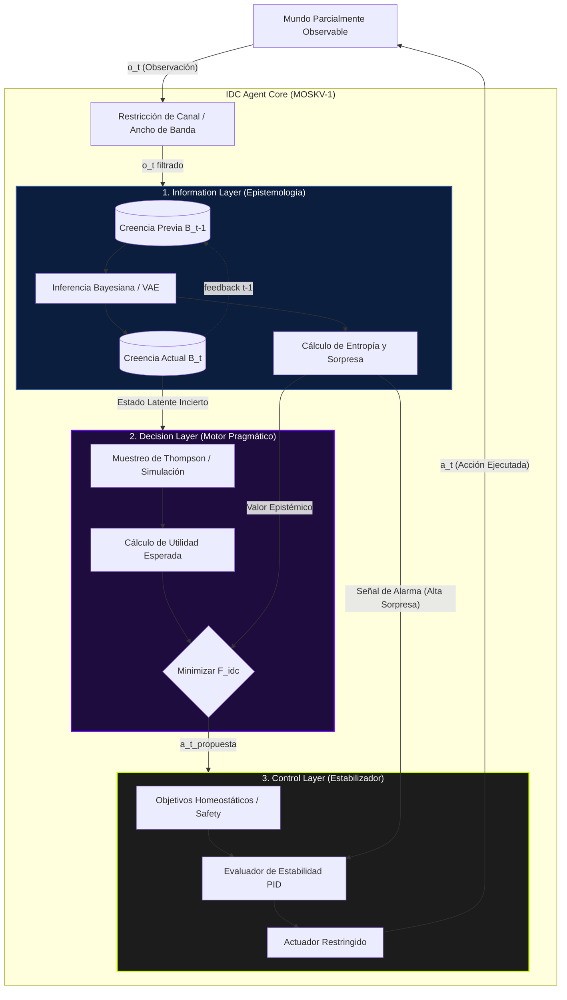

...mantiene un registro (contador de visitas) que aproxima empíricamente la distribución posterior de los estados latentes dadas las observaciones históricas. La transición entre clips durante la "deliberación" del agente simula un muestreo de trayectorias futuras posibles, ponderado por las energías libres esperadas. 

Esta estructura permite que la **percepción y la planificación ocurran en el mismo sustrato**. Durante la percepción, la red se actualiza para reflejar qué estados latentes explican mejor las observaciones actuales (minimizando la energía libre variacional). Durante la planificación (inferencia activa), la simulación proyectiva explora caminos hacia observaciones preferidas, actualizando las políticas de acción para minimizar la energía libre esperada. Lo excepcional de FEPS es que **todo este proceso es tratable analíticamente y matemáticamente transparente**, eliminando la naturaleza de caja negra típica de los enfoques deep learning profunda, sin sacrificar la capacidad de realizar inferencia bayesiana rigurosa.

### 3.2 Arquitecturas de Control Actor-Crítico Basadas en Entropía (MaxEnt RL)

El éxito práctico más contundente de la integración entre información, decisión y control en IA contemporánea se encuentra en la familia de algoritmos **Soft Actor-Critic (SAC)**. SAC es una materialización directa del principio de máxima entropía aplicado al control óptimo estocástico. 

A diferencia del RL estándar que busca maximizar exclusivamente la suma de recompensas corporizadas, SAC maximiza una **función objetivo compuesta: la recompensa esperada más la entropía de la política**. Esto se logra implementando una arquitectura de dos componentes (actor y crítico) donde el actor (la política de decisión) se actualiza para minimizar la Divergencia KL con respecto a la distribución softmax de la función Q (el valor de control) estimada por el crítico.

Desde la perspectiva de nuestro triángulo fundacional:
1. **Información:** La regularización de entropía mantiene el canal de información entre el estado y la acción lo más "abierto" posible, evitando el colapso prematuro de la política en soluciones deterministas e inyectando un comportamiento de máxima exploración empírica.
2. **Decisión:** La actualización del crítico es fundamentalmente una propagación de utilidad esperada (ecuación de Bellman) formulada para incorporar la incertidumbre.
3. **Control:** El lazo de retroalimentación estabiliza el aprendizaje mediante un ajuste automático de la "temperatura" (el hiperparámetro que escala la entropía), funcionando como un termostato cibernético que aumenta la exploración cuando el agente está "atascado" y la reduce cuando ha encontrado un óptimo estable.

---

## 4. El Framework IDC (Information-Decision-Control): Una Síntesis Formal

Habiendo recorrido los pilares (Información, Decisiones, Control) y las teorías unificadoras (Free Energy, Control Estocástico), formalizamos el **Framework IDC**: una arquitectura normativa para Agentes Soberanos. El modelo postula que un agente verdaderamente autónomo no es simplemente un mapeo `f(observación) -> acción`, sino un sistema dinámico homeostático que opera simultáneamente y de manera interdependiente en tres capas funcionales.

### 4.1 Axiomas del Framework IDC

1. **Axioma de Información (Ignorancia Medible):** El agente nunca tiene acceso al estado verdadero del entorno $S$. Solo mantiene una creencia $B(S)$, y el costo de su ignorancia es estrictamente cuantificable en bits mediante la Entropía $H(B)$ y la Divergencia KL.
2. **Axioma de Decisión (Inferencia Activa):** El agente actúa exclusivamente para colapsar su incertidumbre hacia estados que le resultan de alta utilidad (preferencias). La acción óptima $a^*$ es un muestreo de una distribución posterior que equilibra el valor de la información (epistémico) y el valor de la recompensa (pragmático).
3. **Axioma de Control (Homeostasis Dinámica):** Ningún modelo interno es perfecto; el entorno siempre inyectará perturbaciones de entropía. El agente debe poseer lazos de retroalimentación negativa que estabilicen el sistema acotando el error predictivo en un rango finito.

### 4.2 La Función Objetivo Compuesta (The Sovereign Objective)

El agente IDC no optimiza una única variable, sino que resuelve continuamente el siguiente funcional de energía libre esperada extendida (Sovereign Free Energy, $\mathcal{F}_{idc}$):

$$ \min_{\pi} \mathcal{F}_{idc}(\pi) = \underbrace{D_{KL}(q_\pi(s) || p(s|o))}_{\text{Información (Inferencia)}} - \underbrace{\mathbb{E}_{q_\pi}[U(s, a)]}_{\text{Decisión (Pragmática)}} + \underbrace{\lambda \cdot \mathcal{L}(s_t, s_{t-1})}_{\text{Control (Estabilidad)}} $$

Donde:
* El término de **Información** minimiza la sorpresa (garantiza que el agente entienda el mundo).
* El término de **Decisión** maximiza la utilidad esperada bajo la creencia actual.
* El término de **Control** penaliza divergencias cinemáticas inestables (mediante una función de Lyapunov $\mathcal{L}$), asegurando homeostasis temporal y evitando oscilaciones catastróficas.

### 4.3 El Bucle del Agente IDC (Agent Loop)

A diferencia de los ciclos REPL simples o bucles OODA básicos, el bucle IDC opera como un mecanismo de relojería termodinámica:

1. **Ingress (Sensor):** Recibe vector de observaciones $o_t$.
2. **Information Layer (Actualización Bayesiana):** Transforma $o_t$ y el prior $B_{t-1}$ en un posterior $B_t$ usando inferencia (exacta o variacional). Calcula la sorpresa.
3. **Control Layer (Chequeo Homeostático):** Si la sorpresa o tasa de error predictivo supera un umbral crítico $\tau$, dispara un lazo de control PID de bajo nivel para regresar a un estado seguro, suspendiendo deliberaciones pesadas.
4. **Decision Layer (Inferencia Activa):** Si el sistema está estable, proyecta futuros posibles muestreando de $B_t$. Selecciona la política $\pi$ que minimiza $\mathcal{F}_{idc}$ (balanceando exploración epistémica y explotación pragmática).
5. **Egress (Actuador):** Emite la acción $a_t$ e inyecta la entropía de la acción devuelta al entorno.

### 4.4 El "Pegamento Teórico": Equivalencia Marginal

El gran desafío de integrar dominios dispares es la magnitud de sus unidades (bits vs utilidades abstractas vs tasas de error). El Framework IDC plantea el **Principio de Equivalencia Marginal**: En un agente óptimo cerca del equilibrio, el costo en el margen de un bit extra de incertidumbre (entropía) equivale exactamente a la pérdida marginal de utilidad (regret bayesiano) y al aumento marginal de inestabilidad cibernética (varianza del error de control). 

Esta equivalencia permite derivar un "tipo de cambio" endógeno para el agente, dándole una base matemática formal a la "Temperatura" en MaxEnt RL. La temperatura $T$ transduciría *bits* de entropía a *útiles* de recompensa, unificando la termodinámica del canal informacional con la economía de la decisión.

### 4.5 Tabla de Métricas Unificadas

Para operar y monitorear un Agente IDC en producción, se requiere telemetría específica para cada capa y meta-métricas que evalúen la cohesión del sistema.

| Capa | Métrica de Evaluación (Telemetría) | Significado Matemático/Físico | Indicador de Patología |
|:---|:---|:---|:---|
| **Información** | KL Divergence Promedio | Calidad del modelo predictivo | KL consistentemente alto: "Alucinación" o ceguera de sensores. |
| **Información** | Entropía del Posterior $H(B)$ | Nivel medio de incertidumbre | Entropía colapsada prematuramente: Sobreconfianza (sesgo letal). |
| **Decisión** | Information Ratio (IR) | Eficiencia del balance explorar/explotar | IR alto: Costo masivo de ignorancia, exploración inútil. |
| **Decisión** | Regret Empírico Descontado | Distancia de la acción a la óptima a posteriori | Regret lineal: Fracaso del aprendizaje inductivo. |
| **Control** | Amplitud del Lazo de Error | Robustez de la homeostasis interna | Oscilaciones no amortiguadas: Inestabilidad de Lyapunov. |
| **Control** | Acción de Control Picos | Esfuerzo termodinámico de actuación | Saturación sostenida de actuadores: Pérdida de controlabilidad. |
| **Meta (IDC)** | Sovereign Free Energy $\mathcal{F}_{idc}$ | Costo total holístico del sistema | Crecimiento de $\mathcal{F}_{idc}$: Entropía devorando al agente. |

### 4.6 Arquitectura de Referencia (Diagrama)

### 5. Variantes y Direcciones Futuras

1. **Agentes Multi-IDC (Enjambre Bayesiano):** ¿Qué sucede cuando el entorno está formado por otros agentes IDC? La teoría de juegos entra en la función de valor, y el problema del "consenso bizantino" se vuelve un problema de minimización conjunta de entropía y divergencia KL distribuida. De aquí derivan protocolos de enjambre (Swarm Protocols).
2. **Agentes Tool-Using (Control Sintético):** Tradicionalmente el control termina en el actuador físico/software. Un agente que crea herramientas (ej. Demuirge/Aether) está dinámicamente *expandiendo su espacio de estados controlable* manipulando la matriz de observación del entorno a su favor, diluyendo entropía técnica en "compilaciones JIT".
3. **Control Adversario:** En entornos puramente adversarios (Red Team vs Blue Team), el agente debe inyectar intencionalmente alta entropía en el canal de observación del oponente mientras minimiza la suya, formalizando el engaño computacional como una optimización de la Divergencia KL asimétrica.

### Conclusión

La **Ciencia del Agente** no es magia algorítmica; es pura física computacional expresada mediante la síntesis de **Información, Decisión y Control**. Entender que la ignorancia tiene un costo en bits, que el aprendizaje es una transformación geométrica de probabilidades, y que la homeostasis es el requisito innegociable para la persistencia sistémica, nos permite construir agentes que trasciendan la fragilidad de los scripts heurísticos hacia la soberanía de la verdadera AGI fundacional.
